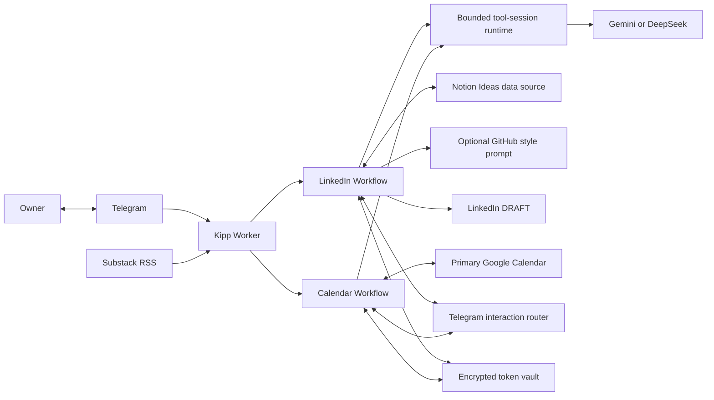

# Kipp

Kipp is a personal workflow assistant built on **Cloudflare Workers and
Workflows**, with Telegram as its primary interface. It currently runs two
independent durable workflows:

- **LinkedIn drafting** captures ideas, generates and revises copy with an LLM,
  waits for explicit Telegram approval, and creates a LinkedIn **DRAFT**. It
  never auto-publishes.
- **Calendar scheduling** turns natural-language Telegram requests into safe
  one-off or recurring Google Calendar events, including clarification,
  conflict choices, fresh revalidation, and a short immediate-edit window.

The workflows share infrastructure without sharing business policy. Each owns
its prompt, tools, terminal outcomes, deterministic rules, and durable state.

## Architecture at a glance



The model owns natural-language interpretation, ambiguity detection, and normal
conversational prose. Typed tools and deterministic code own schema and policy
validation, calculations, recurrence expansion, availability checks, option
authorization, fresh pre-write revalidation, external mutations, idempotency,
and operational recovery.

The shared tool runner permits at most three provider turns and four tool calls
per session. Tools are statically allowlisted and schema-validated. Terminal
handoffs cannot be batched with other calls.

Detailed diagrams and the machine-readable architecture inventory live in
[`docs/architecture/`](docs/architecture/README.md). Calendar's normative
behavior is documented in
[`docs/calendar-workflow-spec.md`](docs/calendar-workflow-spec.md), with its
delivery history and architecture decisions in
[`docs/calendar-workflow-architecture-and-roadmap.md`](docs/calendar-workflow-architecture-and-roadmap.md).

## Workflow behavior

### LinkedIn drafting and review

Ideas enter the Notion Ideas data source through Telegram `/add`, the
configured Substack RSS feed, or manual entry. `/generate` and scheduled
cadence checks select raw Notion pages and can start `PipelineWorkflow`.

The LinkedIn writing agent returns a complete `ready_for_review` response. Kipp
stores the draft, sends it to Telegram, and durably waits for approval or
revision feedback. Feedback resumes the bounded agent with its prior transcript.
Only an explicit **Approve** action allows deterministic code to create a
LinkedIn post with `lifecycleState: DRAFT`, then marks the idea `finalized` in
Notion. A feedback wait expires after `WAIT_FOR_FEEDBACK_HOURS` (up to 11 hours
45 minutes; Cloudflare's 12-hour workflow limit reserves a safety buffer) by
default).

### Calendar scheduling

`/calendar <request>` starts a separate 15-minute `CalendarWorkflow` session.
The Calendar agent can:

- interpret one-off and supported recurring requests;
- ask for missing or ambiguous details;
- list up to 50 projected primary-calendar events over at most 31 days when a
  title or timing reference such as “after my dentist appointment” requires it;
- submit a strict candidate for deterministic policy, recurrence, FreeBusy, and
  conflict evaluation; and
- hand an opaque authorized plan back to the workflow for creation.

The model never writes Calendar. Before every create or update, the workflow
resolves a current single-use plan and revalidates fresh availability. Fixed
Telegram buttons map only to authorized options. Successful writes receive a
deterministic confirmation and an **Edit** action that remains active for the
rest of the 15-minute window.

Calendar supports daily, weekly, biweekly, monthly, and bimonthly recurrence
within a six-calendar-month horizon. Monthly requests preserve the ordinal
weekday of the first occurrence by default; an explicit calendar date such as
“the 8th of every month” uses a day-of-month anchor.

Calendar event listing exposes only opaque reference, title, start/end,
all-day state, transparency, and truncation status. Descriptions, locations,
attendees, organizers, conferencing data, links, credentials, and raw API
responses stay outside model context and content logs.

## Prerequisites

- Node.js 20+
- pnpm 9+ (`corepack enable && corepack prepare pnpm@latest --activate`)
- Cloudflare account — Kipp is currently deployed on the Free tier, including
  Workers, Workflows, Durable Objects, and the
  [Teams Free Base](https://dash.cloudflare.com/?to=/0314b39505295dcfd75993342bae44d2/:zone/access)
  Zero Trust plan used for Cloudflare Access
- Telegram bot from [BotFather](https://t.me/BotFather)
- LinkedIn Developer App with the Share on LinkedIn product
- Google Cloud OAuth web client with the Calendar API enabled
- Notion internal integration and Ideas data source for LinkedIn content
- Optional private GitHub repository for a custom LinkedIn style prompt
- Gemini or DeepSeek API key

## Setup

### 1. Install the application

```bash
git clone git@github.com:satwikhebbar/kipp.git
cd kipp
pnpm install
pnpm lefthook install
```

### 2. Configure Cloudflare Access

Production uses two self-hosted Access applications on the same Worker
hostname:

1. A primary application protects the entire hostname for the administrator.
   Record its audience as `ACCESS_AUDIENCE` and its Zero Trust team name as
   `ACCESS_TEAM`.
2. A second application bypasses **only** `/webhook/telegram`, because Telegram
   cannot complete an Access login.

The webhook bypass remains protected by
`X-Telegram-Bot-Api-Secret-Token` and `TELEGRAM_ALLOWED_USER_ID`. Kipp also
validates Access JWTs inside protected setup, callback, and administrative
routes.

### 3. Configure variables and secrets

Use `wrangler.local.toml` for local non-secret variables and `.dev.vars` for
local secrets. `wrangler.prod.toml` is checked in and defines production
structure only; Cloudflare Dashboard owns production text values and secrets.
See [the production runtime configuration guide](docs/production-runtime-configuration.md)
before adding or changing a variable. Never commit credentials.

| Category | Names |
| --- | --- |
| Telegram | `TELEGRAM_BOT_TOKEN`, `TELEGRAM_WEBHOOK_SECRET`, `TELEGRAM_ALLOWED_USER_ID` |
| LLM | `LLM_API_KEY`, `LLM_PROVIDER`, optional `LLM_MODEL`, `LLM_MAX_RETRIES`; meal planning additionally requires `OPENROUTER_API_KEY` |
| LinkedIn OAuth | `LINKEDIN_CLIENT_ID`, `LINKEDIN_CLIENT_SECRET`, `LINKEDIN_AUTHOR_URN`, optional `LINKEDIN_REDIRECT_ORIGIN` |
| Google OAuth | `GOOGLE_CALENDAR_CLIENT_ID`, `GOOGLE_CALENDAR_CLIENT_SECRET`, optional `GOOGLE_CALENDAR_REDIRECT_ORIGIN` |
| GitHub style prompt | `GITHUB_PAT`, `DATA_REPO_OWNER`, `DATA_REPO_NAME`, `DATA_REPO_BRANCH`, optional `PROMPT_STYLE_PATH` |
| Notion | `NOTION_API_KEY`, `NOTION_IDEAS_DATA_SOURCE_ID` (bare UUID, see step 6), optional `NOTION_FREE_TIER` (`"false"` disables the 350 ms request throttle) |
| Token encryption | `TOKEN_ENCRYPTION_KEY_IDS`, plus one `TOKEN_ENCRYPTION_KEY_<key-id>` secret per listed ID |
| Access | `ACCESS_TEAM`, `ACCESS_AUDIENCE`, `ACCESS_ADMIN_EMAILS` |
| Workflow behavior | `SUBSTACK_RSS_URL`, `POSTING_CADENCE_DAYS`, `WAIT_FOR_FEEDBACK_HOURS`, `TIMEZONE` |
| Runtime | `DEPLOYMENT_ENV`, optional `LOG_LEVEL` |

Generate a 32-byte base64url encryption key and store it under the active key
ID:

```bash
node -e "const c = require('crypto'); console.log(c.randomBytes(32).toString('base64url'))"
pnpm wrangler secret put TOKEN_ENCRYPTION_KEY_k20260720a
```

`TOKEN_ENCRYPTION_KEY_IDS` is ordered: the first key encrypts and every listed
key may decrypt. To rotate keys, add the new ID and secret, call
`POST /admin/rewrap`, then remove the old ID and secret after rewrapping succeeds.

### 4. Connect LinkedIn

Configure the LinkedIn callback URL as:

```text
https://<worker-host>/auth/linkedin/callback
```

Then visit the Access-protected setup route:

```text
https://<worker-host>/setup/linkedin
```

Kipp creates and consumes one-time OAuth state, exchanges the code, encrypts
the resulting token, and stores it in the LinkedIn token namespace.

### 5. Connect Google Calendar

Create a Google OAuth **Web application**, enable the Google Calendar API, and
configure this callback URL:

```text
https://<worker-host>/auth/google-calendar/callback
```

For local development the origin is normally `http://localhost:8787`. Set
`GOOGLE_CALENDAR_REDIRECT_ORIGIN` when the request host is not the desired OAuth
origin, then visit:

```text
https://<worker-host>/setup/google-calendar
```

The requested Calendar consent supports owned-event operations and availability
reads on the connected account's primary calendar; it does not request broad
account access.

### 6. Create the Notion Ideas data source

Kipp stores LinkedIn ideas as pages in a Notion data source. Notion's model has
two layers: a **database** (what you create in the UI) and the **data source**
it contains (what the API addresses). All Kipp requests use the data source ID,
never the database ID.

1. Create a Notion internal integration (Settings → Connections → Develop or
   reuse an existing one) and copy its token as `NOTION_API_KEY`. Give it
   read/write content and property capabilities.
2. Create an empty database with **exactly** these properties:

   | Property | Type | Options / notes |
   | --- | --- | --- |
   | `Title` | Title | Page title |
   | `Kipp ID` | Unique ID | Auto-assigned, read-only; never written by Kipp |
   | `Status` | Status | `raw`, `awaiting-feedback`, `awaiting-feedback-expired`, `finalized` |
   | `Source` | Select | `substack`, `telegram`, `manual` |
   | `Substack URL` | URL | Optional |
   | `Chat ID` | Rich text | Optional; Telegram correlation |
   | `Idempotency Key` | Rich text | Optional; caller-supplied dedup key |

   A missing or mistyped property (e.g. `Kipp ID` as Rich text instead of
   Unique ID) surfaces as a Notion validation error at runtime, so create the
   exact schema before deploying.
3. Share the database with the integration: open the database, click **•••** →
   **Add connections**, and select the integration. Without this, every request
   returns `404 object_not_found` and `/search` lists nothing.
4. Find the data source ID. The "Copy data source ID" button in Notion emits
   `collection://<uuid>`, but the API only accepts the **bare UUID** — strip
   the `collection://` prefix. To fetch it via the API instead, take the
   database ID from the database's URL (the 32-char hex string), then:

   ```bash
   curl "https://api.notion.com/v1/databases/<database-id>" \
     -H "Authorization: Bearer $NOTION_API_KEY" \
     -H "Notion-Version: 2026-03-11"
   ```

   and read `data_sources[0].id`. Set that bare UUID as
   `NOTION_IDEAS_DATA_SOURCE_ID`.

### 7. Register the Telegram webhook

```bash
curl "https://api.telegram.org/bot<TELEGRAM_BOT_TOKEN>/setWebhook?url=https://<worker-host>/webhook/telegram&secret_token=<TELEGRAM_WEBHOOK_SECRET>"
```

## Local development

Telegram permits only one webhook per bot, so use a separate development bot.

1. Put development secrets in `.dev.vars`. For local-only Access bypass and a
   static LinkedIn token fallback, include:

   ```env
   TELEGRAM_BOT_TOKEN="dev_bot_token"
   TELEGRAM_WEBHOOK_SECRET="random_webhook_secret"
   ALLOW_INSECURE_LOCAL_TOKEN_FALLBACK="true"
   LINKEDIN_ACCESS_TOKEN="local_linkedin_token"
   TOKEN_ENCRYPTION_KEY_IDS="k20260720a"
   TOKEN_ENCRYPTION_KEY_k20260720a="base64url_32_byte_key"
   ```

   Never enable `ALLOW_INSECURE_LOCAL_TOKEN_FALLBACK` in production.
2. Add the Notion keys from step 6 to `.dev.vars`: `NOTION_API_KEY` and
   `NOTION_IDEAS_DATA_SOURCE_ID`.
3. Start Kipp with `pnpm dev` (normally on port 8787).
4. Expose it with `ngrok http 8787`.
5. Run `pnpm run webhook:dev` to point the development bot at the active tunnel.

Scheduled jobs (RSS ingest, cadence, token check) do not fire locally on their
own. Start Wrangler with scheduled-event testing and trigger them by URL:

```bash
pnpm exec wrangler dev --config wrangler.local.toml --test-scheduled
curl "http://127.0.0.1:8787/__scheduled?cron=0+9+*+*+*"   # RSS ingest
curl "http://127.0.0.1:8787/__scheduled?cron=0+9+*+*+1"   # cadence
```

Local Durable Objects/Workflows are emulated and isolated per worktree, while
Notion, Telegram, and LLM calls hit the real services.

## Telegram commands

| Command or action | Result |
| --- | --- |
| `/add <text>` | Save a raw LinkedIn idea. |
| `/generate` | Start LinkedIn generation for the next raw idea. |
| **Approve** / **Revise More** / reply | Review or revise the current LinkedIn draft. |
| `/calendar <request>` | Start a one-off or recurring Calendar conversation. |
| Calendar buttons or reply | Select an authorized choice, supply clarification, cancel, retry, or edit. |

## Testing and quality checks

| Command | Purpose |
| --- | --- |
| `pnpm lint` | Check source formatting and lint rules. |
| `pnpm run docs` | Enforce source documentation requirements. |
| `pnpm typecheck` | Run TypeScript checking without emitting files. |
| `pnpm test` | Run the standard Vitest suite. |
| `pnpm test:unit` | Run unit tests. |
| `pnpm test:integration` | Run integration tests against fake external services. |
| `LLM_API_KEY=<key> pnpm test:provider-contract` | Run credential-gated DeepSeek Calendar tool-contract tests. |
| `pnpm check` | Run lint, documentation checks, typecheck, and the standard tests. |

Lefthook runs typecheck, lint, and tests before each commit.

## Deployment

```bash
pnpm run deploy
```

The live deploy command runs the pre-deployment checks and uploads with
`wrangler.prod.toml`. Use `pnpm run deploy`, not `pnpm deploy`: the latter is
pnpm's workspace deployment command. `pnpm deploy:check` runs the same checks
and a Wrangler dry-run without uploading. After a live upload, verify in the
Cloudflare Dashboard that **Observability → Redact query string** remains
enabled. `pnpm dev` uses `wrangler.local.toml`.

### Calendar operational runbook

Before the first deployment, create a Google OAuth **Web application**, enable
the Google Calendar API, and register the exact callback URI used by Kipp:

```text
https://<worker-host>/auth/google-calendar/callback
```

For local development, register `http://localhost:8787/auth/google-calendar/callback`
and set `GOOGLE_CALENDAR_REDIRECT_ORIGIN=http://localhost:8787`. The Google
client requires only `calendar.events.owned` and `calendar.events.freebusy`; it
operates on the connected account's primary calendar. Store
`GOOGLE_CALENDAR_CLIENT_ID` and `GOOGLE_CALENDAR_CLIENT_SECRET` as secrets, not
in either Wrangler configuration file.

Before deploying a Calendar change, confirm that production has the
`CALENDAR_WORKFLOW`, `TOKEN_VAULT`, and `INTERACTION_ROUTER` bindings from the
checked-in Wrangler configuration; the Access-protected Google setup route; the
Telegram webhook secret and allowed user ID; an IANA `TIMEZONE`; and production
token-encryption keys. Use `LOG_LEVEL=info` only when structured operational
logs are required. Those records contain outcome categories, opaque workflow or
interaction IDs, safe failure details, and retry counts—never Calendar content,
Telegram text, OAuth codes, tokens, or provider response bodies.

Run `pnpm check`, then `pnpm run deploy`. Validate the deployed slice only with the
separate development Telegram bot: connect its Google account through
`/setup/google-calendar`, create a uniquely labelled, short-lived `/calendar`
test event (and one supported short test series when recurrence changes), inspect
the primary calendar fields and confirmation/Edit behavior, and delete every
test event during cleanup. Do not point the production bot at this smoke route.

| Symptom | Safe operator action |
| --- | --- |
| “Google Calendar is not connected” or a revoked token | Open the protected `/setup/google-calendar` route, complete consent, then use the existing **Retry** control within 15 minutes. OAuth completion never creates an event automatically. |
| Google rejects the OAuth redirect | Match the Google Console redirect URI exactly to the deployed host and `GOOGLE_CALENDAR_REDIRECT_ORIGIN`, then begin a new setup attempt. |
| `/calendar` reports that Calendar is not configured | Verify the workflow binding and both Google OAuth secrets in the target Cloudflare environment; do not add credentials to tracked configuration. |
| A request fails temporarily | Retry only through a new user request or the explicit authorization-recovery control. Kipp's client makes at most two transient retries and reuses the same opaque event identity; do not run manual duplicate creates. |
| A confirmation is missing after a Calendar write | Check metadata-only Worker logs by opaque workflow ID. Confirmation recovery never repeats the Calendar write, so inspect the primary calendar before sending another request. |
| A button has no effect | It may be consumed, superseded, wrong-chat, or past the 15-minute expiry. Start a new `/calendar` request rather than replaying controls. |
| Telegram returns webhook authentication failures | Reconcile the webhook `secret_token` with `TELEGRAM_WEBHOOK_SECRET`, keep the webhook bypass limited to `/webhook/telegram`, and retain Access protection for setup and administrative routes. |

## Repository layout

```text
src/
├── index.ts                       Worker entry, routes, and cron dispatch
├── calendar/                      Calendar workflow domain
│   ├── workflow.ts                Calendar WorkflowEntrypoint
│   ├── agent-workflow.ts          Calendar agent/conversation orchestration
│   ├── evaluation.ts              Calendar candidate evaluation
│   ├── plan.ts                    Calendar plan ledger
│   ├── validation.ts              Calendar issue validation
│   ├── scheduling.ts              Calendar event scheduling
│   ├── recurrence.ts              Calendar recurrence handling
│   └── messages.ts                Calendar message formatting
├── linkedin/                      LinkedIn pipeline workflow
│   ├── workflow.ts                LinkedIn durable workflow
│   ├── ideas/                     Notion-backed idea management
│   └── prompts/                   LinkedIn style-prompt resolution
├── agent/                         Shared agent sessions, prompts, tools, and terminal outcomes
├── core/                          Cross-workflow shared infrastructure
│   ├── types.ts                   Shared contracts
│   ├── conversation.ts            Transcript assembly and guards
│   ├── cost.ts                    LLM cost estimation
│   ├── crypto.ts                  Encryption helpers
│   ├── idea-ingest.ts             Durable idea ingest and workflow-start ownership
│   ├── interaction-router*.ts     Short-lived Telegram interaction routing
│   └── token-vault*.ts            Encrypted provider token storage
├── runtime/                       Shared bounded tool runner and guards
├── triggers/                      Telegram, OAuth, RSS, cadence, and token checks
├── integrations/                  Notion, GitHub, Telegram, LinkedIn, and Google Calendar clients
├── providers/                     Gemini and DeepSeek adapters
├── __tests__/                     Unit tests
├── __integration__/               Workflow and boundary integration tests
└── __contract__/                  Credential-gated provider contract tests
```

## License

MIT
