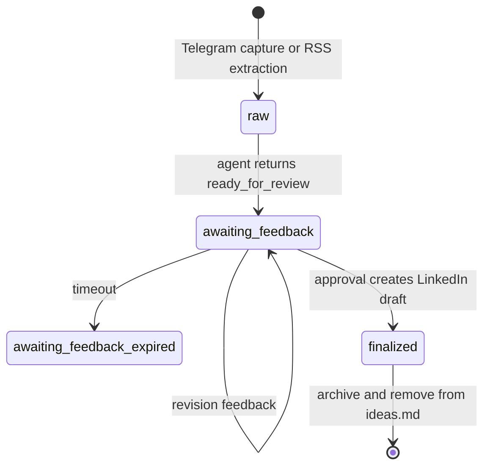
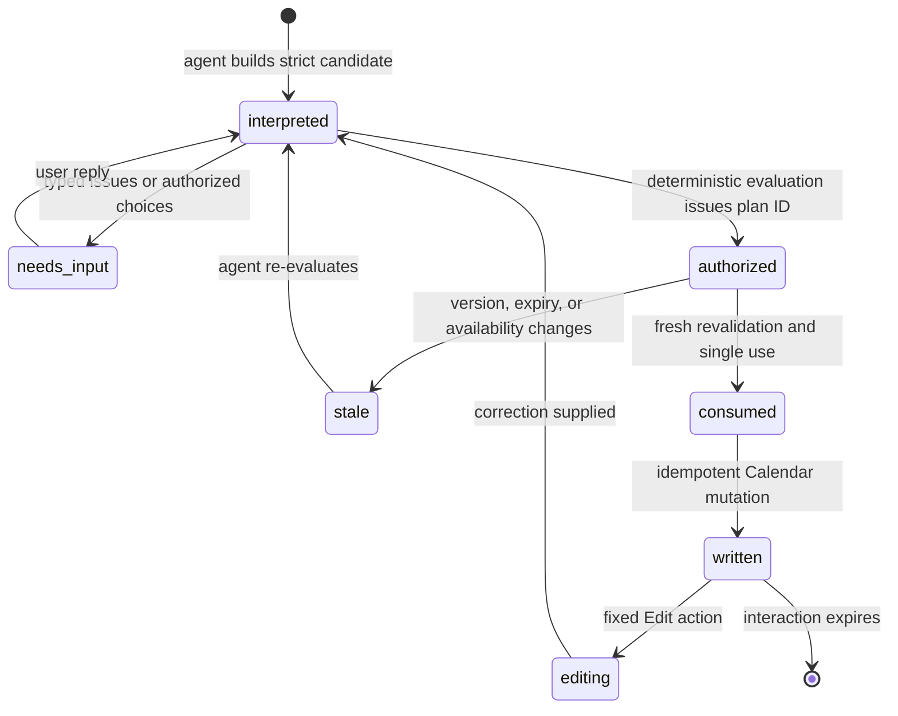

# Data and state

Kipp intentionally splits state by lifecycle, sensitivity, and owning
workflow. It does not use a general-purpose application database.

```mermaid
flowchart LR
  telegram["Telegram ingress"] --> linkedinFlow["PipelineWorkflow"]
  telegram --> calendarFlow["CalendarWorkflow"]
  rss["RSS trigger"] --> ideas["ideas.md"]

  linkedinFlow <--> ideas
  linkedinFlow --> archive["archive.md"]
  linkedinFlow --> style["style-prompt.md"]
  linkedinFlow <--> router["InteractionRouterDO SQLite"]
  calendarFlow <--> router
  linkedinFlow <--> vault["TokenVaultDO SQLite"]
  calendarFlow <--> vault
  linkedinFlow --> linkedinState["LinkedIn Workflow state"]
  calendarFlow --> calendarState["Calendar Workflow state"]

  subgraph github["Private GitHub data repository"]
    ideas
    archive
    style
  end
```

| Store | Data | Lifecycle and protection |
| --- | --- | --- |
| Private GitHub data repository | `ideas.md`, `archive.md`, optional `style-prompt.md` | LinkedIn content backlog accessed with a GitHub PAT. Calendar does not use this store. |
| `TokenVaultDO` SQLite | Short-lived OAuth state; provider-namespaced encrypted LinkedIn and Google Calendar tokens | OAuth state expires after five minutes. Tokens use AES-256-GCM and configured key IDs and can be rewrapped during rotation. |
| `InteractionRouterDO` SQLite | Opaque callback or reply registration, workflow target, interaction kind, version, expiry, and delivery state | Contains no request prose or credentials. Entries are claimed idempotently and expire after the owning interaction window. |
| `PipelineWorkflow` state | LinkedIn agent transcript, review version, approval or revision events, usage, and step results | Durable across the configured feedback wait. Transcript output is bounded before persistence. |
| `CalendarWorkflow` state | Bounded safe transcript, versioned plan/option ledger, exact evaluated plans, created-event baseline, and interaction events | Exists for the 15-minute Calendar conversation. Provider reasoning is removed; obsolete event-list results are compacted; IDs expire and are single-use. |

Calendar event content is not copied into the private GitHub data repository or
the interaction router. The model can see only user text and the narrow event
projection explicitly returned by `list_calendar_events`; descriptions,
locations, attendees, organizers, conferencing data, links, credentials, and
raw provider responses remain outside model context and content logs.

## LinkedIn idea lifecycle



`drafted` and `skipped` remain valid data statuses for compatibility, but the
current workflow moves generated content directly to `awaiting-feedback`.

## Calendar plan lifecycle



The workflow persists a complete created-event baseline after a write so an
immediate edit can re-evaluate without guessing or recreating the event.
