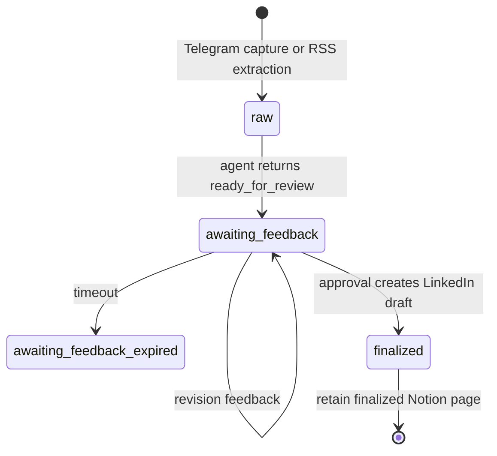
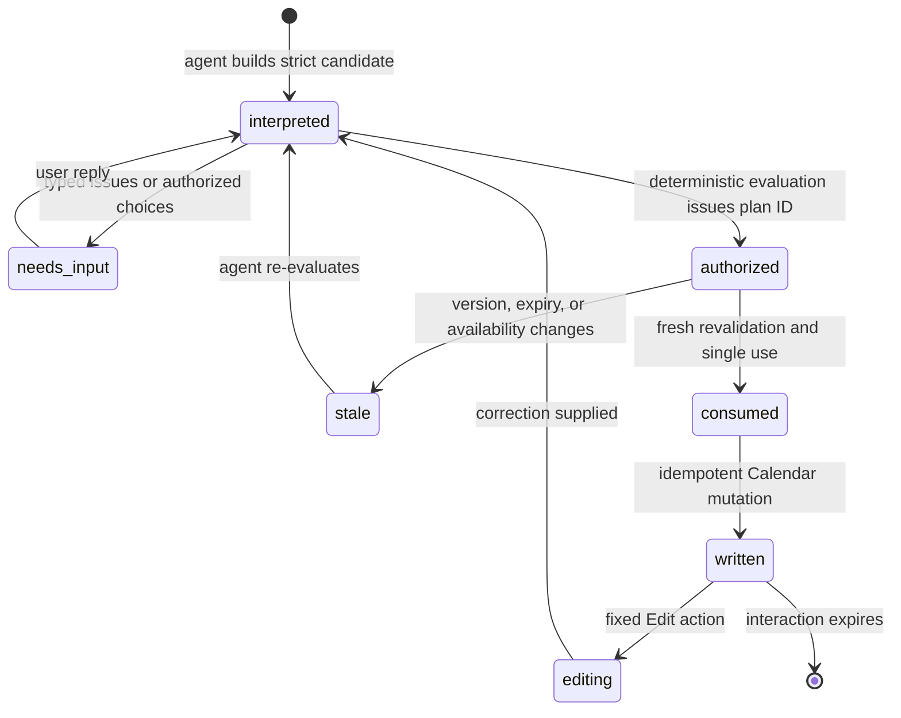
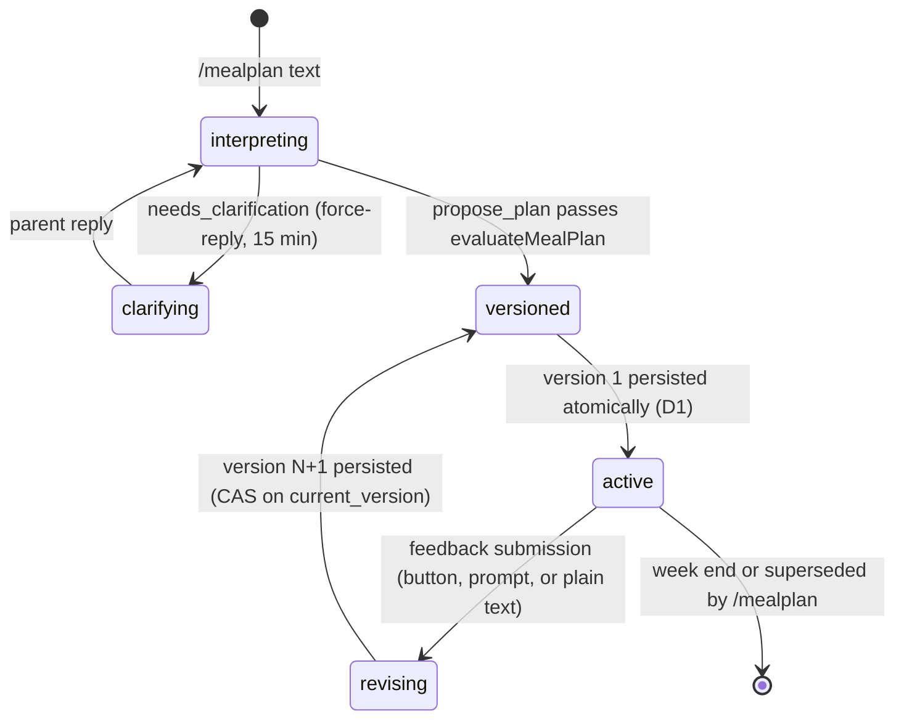

# Data and state

Kipp intentionally splits state by lifecycle, sensitivity, and owning
workflow. It does not use a general-purpose application database.

```mermaid
flowchart LR
  telegram["Telegram ingress"] --> linkedinFlow["PipelineWorkflow"]
  telegram --> calendarFlow["CalendarWorkflow"]
  telegram --> mealFlow["MealPlanningWorkflow"]
  rss["RSS trigger"] --> ingest["IdeaIngestDO SQLite"]
  telegram --> ingest
  ingest <--> ideas["Notion Ideas data source"]

  linkedinFlow <--> ideas
  linkedinFlow --> style["style-prompt.md"]
  linkedinFlow <--> router["InteractionRouterDO SQLite"]
  calendarFlow <--> router
  mealFlow <--> router
  mealFlow <--> mealDb["MEAL_PLANNING_DB D1"]
  mealFlow --> videoCache["RECIPE_VIDEO_CACHE KV"]
  linkedinFlow <--> vault["TokenVaultDO SQLite"]
  calendarFlow <--> vault
  linkedinFlow --> linkedinState["LinkedIn Workflow state"]
  calendarFlow --> calendarState["Calendar Workflow state"]
  mealFlow --> mealState["Meal-planning Workflow state"]

  subgraph notion["Notion"]
    ideas
  end

  subgraph github["Optional private GitHub repository"]
    style
  end
```

| Store | Data | Lifecycle and protection |
| --- | --- | --- |
| Notion Ideas data source | LinkedIn idea page bodies plus `Kipp ID`, status, source, Substack URL, chat ID, and idempotency-key properties | The LinkedIn content store. `IdeaIngestDO` serializes idempotent creation and claims a deterministic workflow instance per page. Calendar does not use this store. |
| Optional private GitHub repository | `style-prompt.md` or a configured prompt path | Supplies a custom LinkedIn style prompt through the Contents API; Kipp falls back to its built-in prompt when unavailable. |
| `IdeaIngestDO` SQLite | Idempotency-key ownership records; per-page workflow-start state and repair cooldown | Prevents duplicate Notion pages and workflow starts across Telegram, RSS, and cadence entry points. |
| `TokenVaultDO` SQLite | Short-lived OAuth state; provider-namespaced encrypted LinkedIn and Google Calendar tokens | OAuth state expires after five minutes. Tokens use AES-256-GCM and configured key IDs and can be rewrapped during rotation. |
| `InteractionRouterDO` SQLite | Opaque callback or reply registration, workflow target, interaction kind, version, expiry, and delivery state | Contains no request prose or credentials. Entries are claimed idempotently and expire after the owning interaction window. |
| `PipelineWorkflow` state | LinkedIn agent transcript, review version, approval or revision events, usage, and step results | Durable across the configured feedback wait. Transcript output is bounded before persistence. |
| `CalendarWorkflow` state | Bounded safe transcript, versioned plan/option ledger, exact evaluated plans, created-event baseline, and interaction events | Exists for the 15-minute Calendar conversation. Provider reasoning is removed; obsolete event-list results are compacted; IDs expire and are single-use. |
| `MEAL_PLANNING_DB` D1 | Household profile (seeded), active plan header, immutable plan versions, immutable feedback batches, and the chat-scoped plan-message generation counter | The canonical meal-planning store. One active plan per chat (partial unique index, serialize-and-supersede); version rows and feedback batches are insert-only; revisions are CAS-guarded on `current_version` and change nothing when stale. No transcripts or raw provider text are stored. |
| `RECIPE_VIDEO_CACHE` KV | Per-dish/slot recipe-video search results for lunch cells | Optional enrichment cache with a 24-hour per-key expiry (`expirationTtl`), so it needs no expiry sweep. A missing or stale video never blocks a plan. |

Calendar event content is not copied into the Notion Ideas data source or
the interaction router. The model can see only user text and the narrow event
projection explicitly returned by `list_calendar_events`; descriptions,
locations, attendees, organizers, conferencing data, links, credentials, and
raw provider responses remain outside model context and content logs.

## LinkedIn idea lifecycle



`drafted` and `skipped` remain valid data statuses for compatibility, but the
current workflow moves generated content directly to `awaiting-feedback`.

## Calendar plan lifecycle



The workflow persists a complete created-event baseline after a write so an
immediate edit can re-evaluate without guessing or recreating the event.

## Meal-planning plan lifecycle



A created plan is approved by default. One instance lives per chat-week; a
fresh `/mealplan` supersedes the active plan (last-commit-wins, one active
plan per chat), and superseded action buttons and prompts resolve nothing via
the chat-scoped generation counter.
