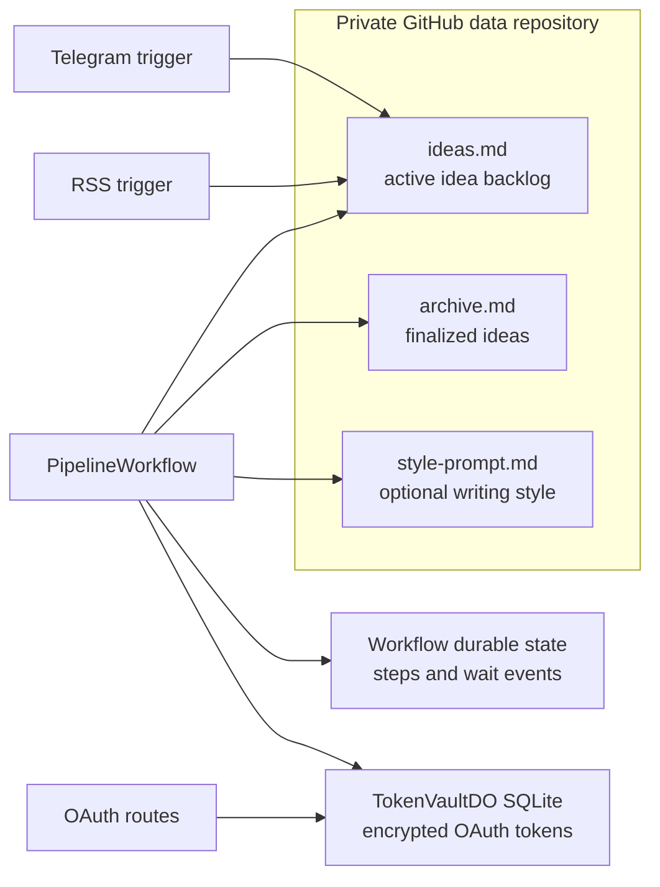
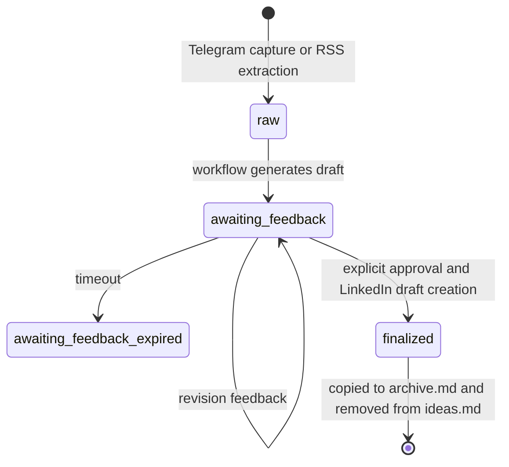

# Data and state

Kipp does not use a conventional application database. Its state is intentionally
split by durability and sensitivity.

| Store | Data | Lifecycle and protection |
| --- | --- | --- |
| Private GitHub data repository | `ideas.md`, `archive.md`, optional `style-prompt.md` | Accessed with a GitHub PAT; the backlog manager manages parsing, updates, archival, and retention. |
| Durable Object SQLite | OAuth state records and encrypted LinkedIn tokens | OAuth state expires after five minutes. Tokens are encrypted with AES-256-GCM using a configured key ID and can be rewrapped after key rotation. |
| Cloudflare Workflows | Durable steps, draft transcript, and Telegram wait events | A workflow waits for feedback without a running Worker process. Workflow step output is bounded by `conversation.ts`. |

## Idea lifecycle

`drafted` and `skipped` remain valid domain statuses for data compatibility, but
the current workflow moves a generated idea directly to `awaiting-feedback`.
