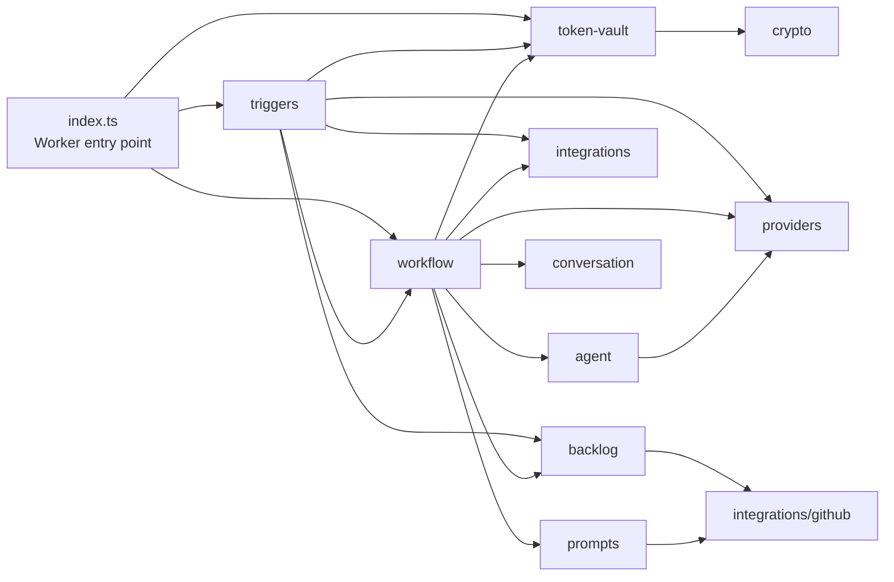

# Modules

The dependency direction is from orchestration and entry points toward domain
modules and integrations. `backlog`, `agents`, `providers`, `prompts`, and
`crypto` do not depend on the Worker entry point, a trigger, or the workflow.

| Module | Responsibility | Key dependencies |
| --- | --- | --- |
| `triggers/` | Adapts HTTP and scheduled events into application actions. | Backlog, integrations, providers, workflow, token vault |
| `workflow.ts` | Orchestrates draft, critique, revision, notification, approval wait, and archive actions. | Agents, backlog, conversation, integrations, prompts, providers, token vault |
| `backlog/` | Parses and mutates the Markdown idea backlog and archive. | GitHub integration |
| `agent/` | Builds drafting, critique, revision, and classification behavior over a normalized generator. | Providers |
| `providers/` | Selects Gemini or DeepSeek and normalizes the generation interface. | Provider SDK/API |
| `integrations/` | Implements GitHub, Telegram, and LinkedIn API clients. | External APIs |
| `prompts/` | Resolves the style prompt from the data repository with a built-in fallback. | GitHub integration |
| `token-vault.ts` + `crypto.ts` | Stores OAuth state and encrypts LinkedIn tokens at rest. | Durable Object SQLite, Web Crypto |
| `conversation.ts` | Builds the workflow conversation transcript and enforces Workflow output limits. | Provider message types |

`types.ts` supplies shared data contracts. Tests are consumers of these modules,
not a production architecture layer.
