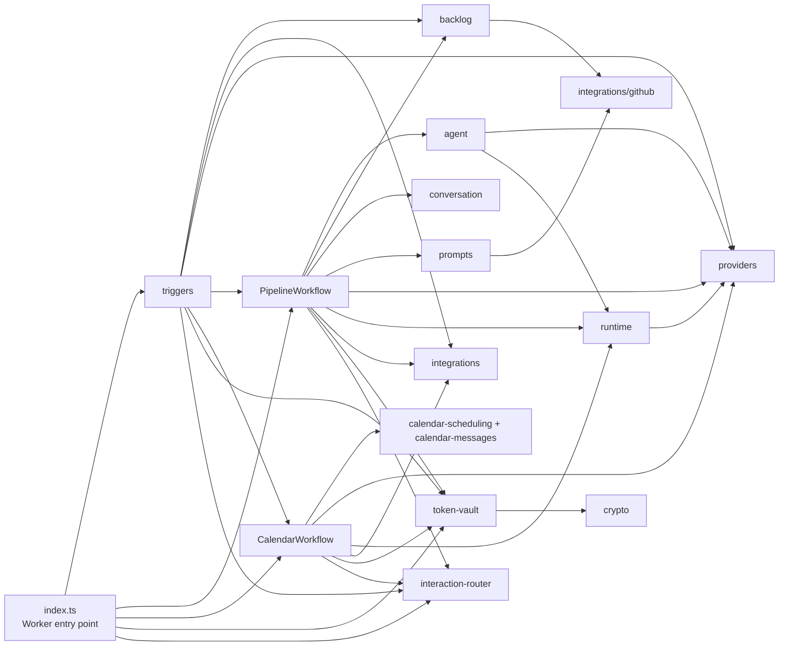

# Modules

The dependency direction is from orchestration and entry points toward domain
modules and integrations. LinkedIn and Calendar share provider, runtime,
interaction-routing, and token-vault infrastructure while retaining separate
workflow policy.

| Module | Responsibility | Key dependencies |
| --- | --- | --- |
| `triggers/` | Adapts HTTP, Telegram, OAuth, and scheduled events into application actions. | Backlog, integrations, providers, both workflows, interaction router, token vault |
| `workflow.ts` | Orchestrates bounded LinkedIn native-tool drafting/revision, notification, approval wait, deterministic publication, and archive actions. | Agents, backlog, conversation, integrations, interaction router, prompts, providers, runtime, token vault |
| `calendar-workflow.ts` | Owns bounded Calendar interpretation and deterministic one-off validation, availability, conflict, write, clarification, edit, and authorization-recovery states. | Calendar domain, Google Calendar integration, interaction router, providers, runtime, token vault |
| `calendar-scheduling.ts` + `calendar-messages.ts` | Implements pure scheduling policy, conflict alternatives, and privacy-safe Calendar messages. | Shared types |
| `backlog/` | Parses and mutates the Markdown idea backlog and archive. | GitHub integration |
| `agent/` | Defines the LinkedIn native-tool prompt, typed draft handoff, revision transcript, and supporting classification/text-agent behavior. | Providers, runtime |
| `providers/` | Selects Gemini or DeepSeek and normalizes text generation plus native tool declarations, calls, and results. | Provider SDK/API |
| `runtime/` | Supplies the typed tool registry and guard, bounded tool runner, context contract, metadata-only logging, and shared HTTP constants. | Providers, Zod |
| `interaction-router.ts` + `interaction-router-client.ts` | Stores and resolves short-lived opaque Telegram interactions with idempotent claim/acknowledgement and expiry. | Durable Object SQLite |
| `integrations/` | Implements GitHub, Telegram, LinkedIn, and Google Calendar API clients. | External APIs |
| `prompts/` | Resolves the style prompt from the data repository with a built-in fallback. | GitHub integration |
| `token-vault.ts` + `token-vault-client.ts` + `crypto.ts` | Stores short-lived OAuth state and provider-namespaced encrypted LinkedIn/Calendar tokens, including refresh and key rewrapping. | Durable Object SQLite, Web Crypto |
| `conversation.ts` | Preserves serializable LinkedIn transcript state and enforces Workflow output limits. | Provider message types |

`types.ts` supplies shared data contracts. Tests are consumers of these modules,
not a production architecture layer.
