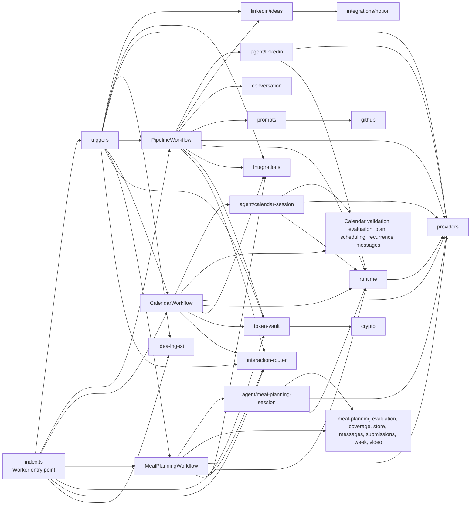

# Modules

The dependency direction is from orchestration and entry points toward domain
modules and integrations. LinkedIn, Calendar, and Meal planning share provider,
runtime, and interaction-routing infrastructure while retaining separate
workflow policy. Meal planning adds the D1 and KV stores and the YouTube Data
API integration as its own domain surface.

| Module | Responsibility | Key dependencies |
| --- | --- | --- |
| `triggers/` | Adapts HTTP, Telegram, OAuth, and scheduled events into application actions. | Ideas, IdeaIngest, integrations, providers, both workflows, interaction router, token vault |
| `linkedin/workflow.ts` | Orchestrates bounded LinkedIn native-tool drafting/revision, notification, approval wait, deterministic publication, and Notion lifecycle updates. | Agents, ideas, conversation, integrations, interaction router, prompts, providers, runtime, token vault |
| `calendar/workflow.ts` + `calendar/agent-workflow.ts` | Runs the bounded Calendar agent session, persists its safe transcript and opaque plan ledger, maps fixed actions, revalidates fresh state, and performs idempotent writes and recovery. | Calendar agent, Calendar domain, Google Calendar integration, interaction router, providers, runtime, token vault |
| `calendar/validation.ts` + `calendar/evaluation.ts` + `calendar/plan.ts` | Defines strict one-off/recurring proposal validation, aggregates typed semantic issues, evaluates safe candidates, and authorizes versioned single-use plan and option IDs. | Scheduling and recurrence domains, Google Calendar integration |
| `calendar/scheduling.ts` + `calendar/recurrence.ts` + `calendar/messages.ts` | Implements time-zone conversion, availability policy, recurrence expansion, candidate selection, Calendar event projection, and deterministic operational or post-write messages. | Shared types, Google Calendar types, `rrule` |
| `meal-planning/workflow.ts` + `meal-planning/agent-workflow.ts` | Runs the bounded meal-planning agent session, enriches lunch cells with optional recipe videos, persists plans atomically, sends Telegram feedback and contextual Mini App review actions, and parks in a week-long live loop that turns claimed feedback batches into revisions. | Meal-planning domain, agent, providers, runtime, interaction router, D1 store, KV video cache |
| `meal-planning/mini-app-auth.ts` + `meal-planning/mini-app-routes.ts` + `meal-planning/mini-app/` | Verifies Telegram Mini App launch data, issues short-lived opaque sessions, exposes an authorized ready-or-empty plan DTO, accepts idempotent feedback batches, and serves the dependency-free phone review client. | Telegram bot token, D1 binding, MealPlanningWorkflow |
| `meal-planning/store.ts` | D1 client (plus in-memory fake) for the household profile, active plan, immutable plan versions, sole feedback-batch ledger, private review contexts, short-lived sessions, and generation counter; enforces one-active-plan and stale-rejection invariants atomically. | D1 binding |
| `meal-planning/evaluation.ts` + `meal-planning/coverage.ts` + `meal-planning/corpus/` | Deterministic `evaluateMealPlan` over typed candidates, the coverage-set resolver, and the validated #64 scenario corpus. | Shared types |
| `meal-planning/messages.ts` + `meal-planning/submissions.ts` + `meal-planning/week.ts` | Deterministic plan rendering, the canonical `Submission`/`FeedbackItem` payload coercion, and Mon–Sat week resolution. | Shared types |
| `meal-planning/video.ts` | Optional, never-blocking YouTube recipe-video discovery for school-lunch and home-lunch cells with a 24 h KV cache and a per-plan call ceiling. | YouTube Data API, KV namespace |
| `linkedin/ideas/` | Manages Notion-backed idea creation, retrieval, lifecycle updates, and metadata queries. | Notion integration |
| `core/idea-ingest.ts` | Serializes idempotent Notion ingestion and owns deterministic workflow starts per idea page. | Ideas, Notion integration, PipelineWorkflow, Durable Object SQLite |
| `agent/` | Defines workflow-specific bounded sessions, prompts, tool contracts, safe transcript handling, and terminal outcomes: Calendar `ready_to_create`/`needs_user_input`, LinkedIn `ready_for_review`, and Meal-planning `propose_plan`/`needs_clarification`. | Providers, runtime, Calendar evaluation and plans, Meal-planning evaluation |
| `providers/` | Selects Gemini or DeepSeek and normalizes text generation plus native tool declarations, calls, and results. | Provider SDK/API |
| `runtime/` | Supplies the typed tool registry and guard, three-turn/four-call bounded runner, batching and handoff policy, shared agent-session result, metadata-only logging, and HTTP constants. | Providers, Zod |
| `core/interaction-router.ts` + `core/interaction-router-client.ts` | Stores and resolves short-lived opaque Telegram interactions with idempotent claim/acknowledgement and expiry. | Durable Object SQLite |
| `integrations/` | Implements Notion, GitHub, Telegram, LinkedIn, and Google Calendar API clients. | External APIs |
| `linkedin/prompts/` | Resolves the style prompt from optional GitHub content with a built-in fallback. | GitHub integration |
| `core/token-vault.ts` + `core/token-vault-client.ts` + `core/crypto.ts` | Stores short-lived OAuth state and provider-namespaced encrypted LinkedIn/Calendar tokens, including refresh and key rewrapping. | Durable Object SQLite, Web Crypto |
| `core/conversation.ts` | Preserves serializable LinkedIn transcript state and enforces Workflow output limits. | Provider message types |

`types.ts` supplies shared data contracts. Tests are consumers of these modules,
not a production architecture layer.
