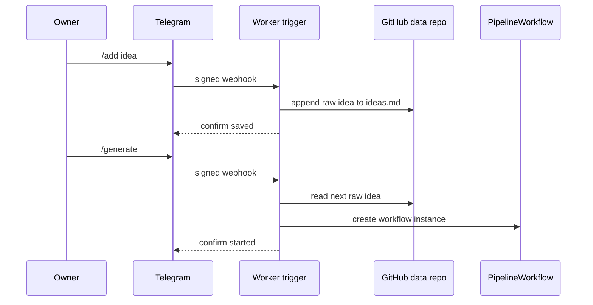
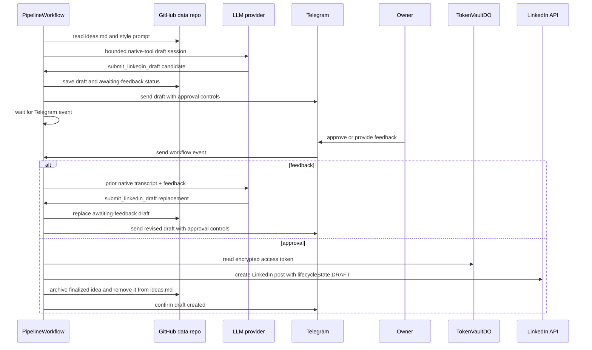
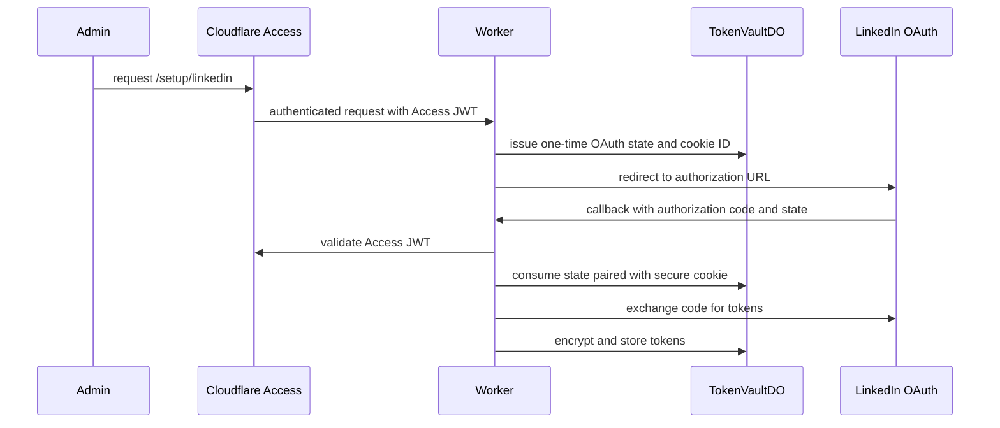

# Request flows

## Idea capture and generation

Telegram `/add` writes a raw idea to the private data repository. Telegram
`/generate`, the daily RSS poll, and the weekly cadence check can all create a
workflow instance.

## Draft, review, and LinkedIn draft creation

If the workflow does not receive feedback within `WAIT_FOR_FEEDBACK_HOURS`, it
marks the idea `awaiting-feedback-expired` and ends the run.

## LinkedIn OAuth setup

The Monday token-check schedule refreshes a token when possible or alerts the
allowed Telegram user when it is near expiry and cannot be refreshed.
