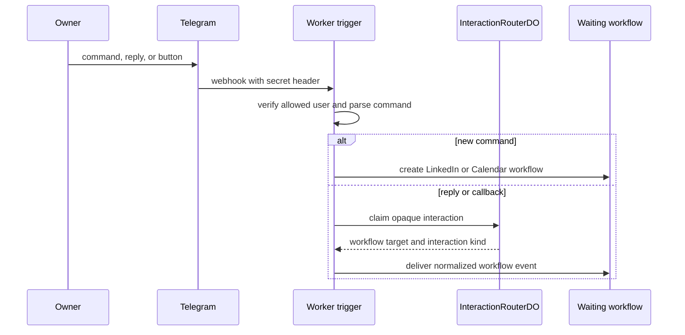
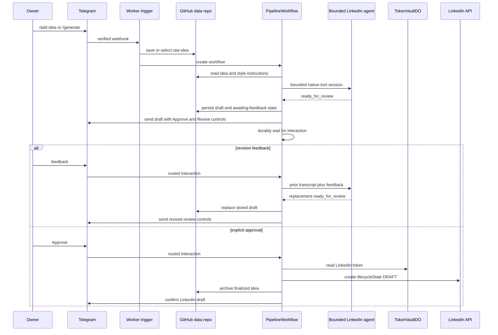
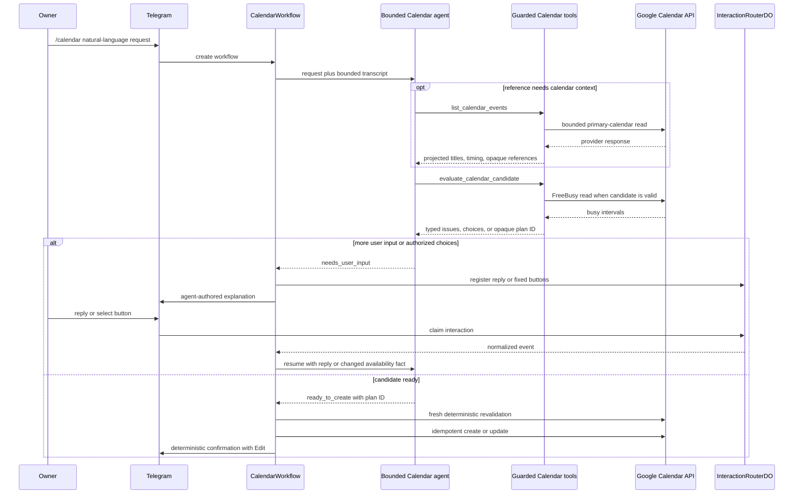
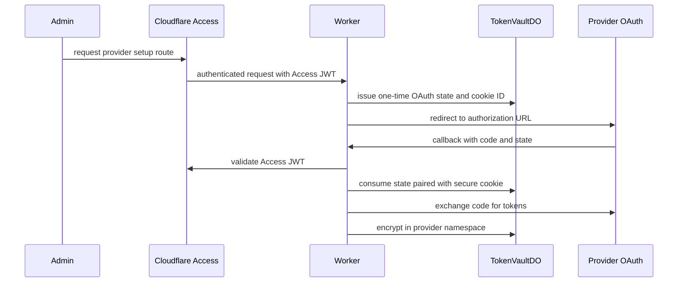

# Request flows

## Telegram ingress and interaction routing

Telegram commands start workflows; replies and callback buttons resume the
specific waiting workflow through short-lived opaque registrations.

## LinkedIn idea capture, generation, and review

Telegram `/add` writes a raw idea to the private data repository. `/generate`,
the daily RSS poll, and the weekly cadence check may start `PipelineWorkflow`.
The LinkedIn agent returns a workflow-specific `ready_for_review` terminal
outcome; it cannot approve, publish, archive, or access credentials.

No LinkedIn post is auto-published. If feedback does not arrive within
`WAIT_FOR_FEEDBACK_HOURS`, the idea becomes `awaiting-feedback-expired`.

## Calendar conversation, evaluation, and write

Calendar uses a bounded agent to interpret ordinary language and explain typed
outcomes. Deterministic evaluation owns date arithmetic, policy, recurrence,
FreeBusy checks, candidate ranking, and opaque plan authorization. Only the
workflow can revalidate and write.

`list_calendar_events` is limited to the primary calendar, a 31-day range, 50
projected events, and safe fields. `evaluate_calendar_candidate` performs
availability checks; neither model-facing tool mutates Calendar. Opaque plan
and option IDs are version-scoped, expiring, and single-use. A successful write
is never repeated merely because Telegram confirmation failed.

## OAuth setup

LinkedIn and Google Calendar use the same protected setup pattern and separate
provider namespaces in the encrypted token vault.

The weekly token check refreshes LinkedIn credentials when possible or alerts
the allowed Telegram user when reconnection is required. Calendar refreshes an
expired access token during a request and offers deterministic reconnect/retry
recovery when authorization is no longer usable.
