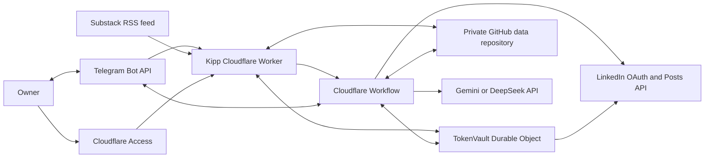
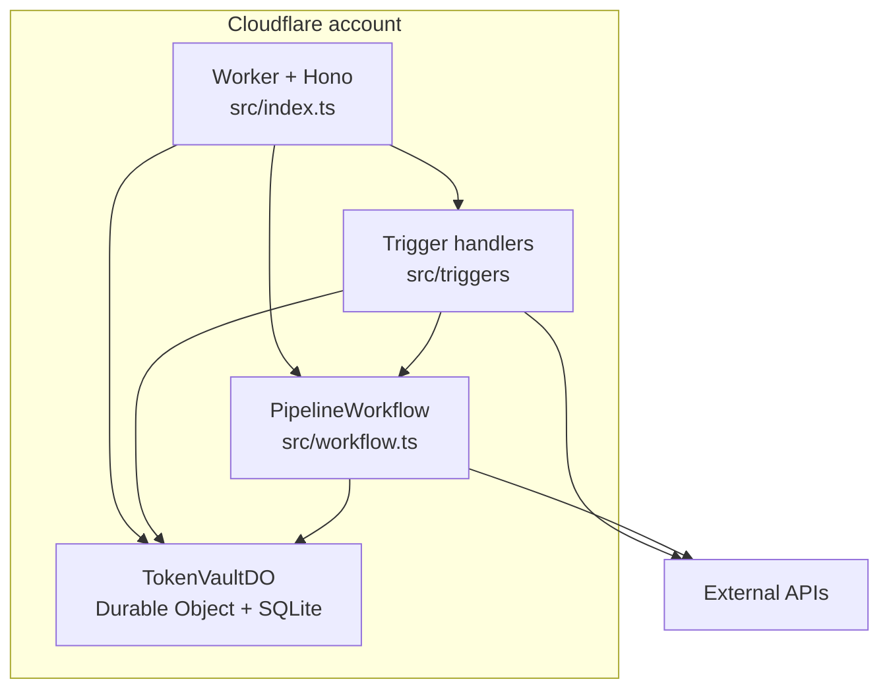

# System and runtime

Kipp is a Cloudflare Worker that captures content ideas, generates and revises
LinkedIn copy, and creates a LinkedIn **draft** only after explicit Telegram
approval. It never publishes a post directly.

## System context

## Cloudflare containers

`src/index.ts` provides the Worker entry point and Hono HTTP routes. It also
dispatches the three configured cron schedules. The worker delegates business
work to trigger handlers and `PipelineWorkflow`; it does not own the core draft
loop itself.

The Worker has five HTTP routes: the health response, Telegram webhook,
LinkedIn OAuth start and callback, and administrative token rewrapping.
Cloudflare Access protects the Worker hostname in production. A separate Access
application bypasses only `/webhook/telegram` so Telegram can deliver updates;
the Worker then verifies Telegram's webhook-secret header and allowed-user
configuration. Setup, OAuth callback, and rewrapping require a valid Access JWT
in the Worker.
