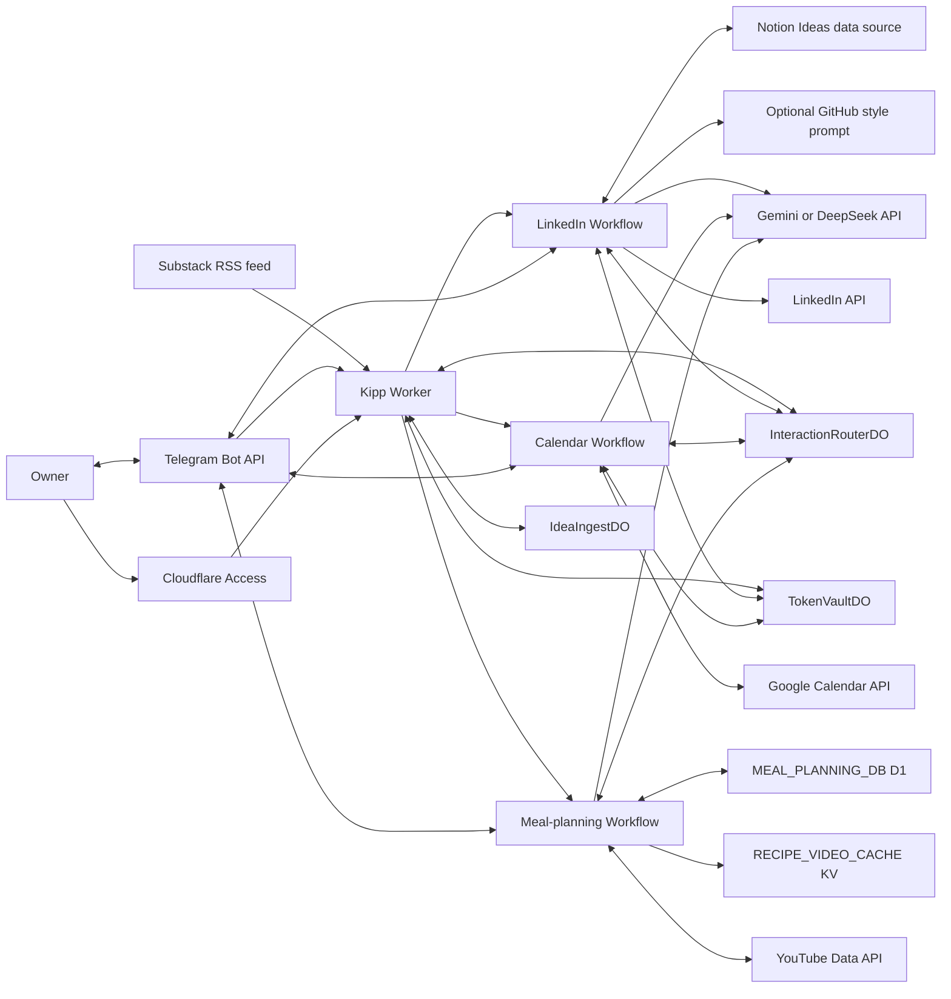
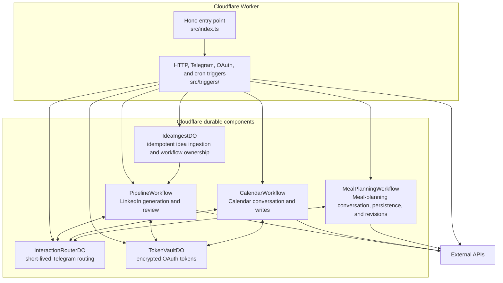

# System and runtime

Kipp is a personal workflow assistant on Cloudflare Workers. Telegram is its
primary user interface. Separate durable workflows currently handle LinkedIn
drafting, personal Google Calendar scheduling, and school-week meal planning
while sharing a bounded agent runtime, interaction routing, OAuth storage, and
external integrations.

## System context

The model is a participant inside each workflow, not the workflow controller.
Workflow-specific, schema-validated tools let it interpret requests and hand
back a terminal outcome. Deterministic code retains authentication, policy,
authorization, revalidation, mutations, and operational recovery.

## Cloudflare containers

`src/index.ts` exposes seven routes: health, Telegram webhook, LinkedIn and
Google Calendar OAuth starts, both OAuth callbacks, and administrative token
rewrapping. It also dispatches the daily RSS poll, weekly token check, and
weekly LinkedIn cadence check.

Cloudflare Access protects the Worker hostname in production. A separate
Access application bypasses only `/webhook/telegram`; the Worker still verifies
Telegram's webhook-secret header and allowed user. Setup, OAuth callback, and
rewrapping routes validate the Access JWT inside the Worker.
