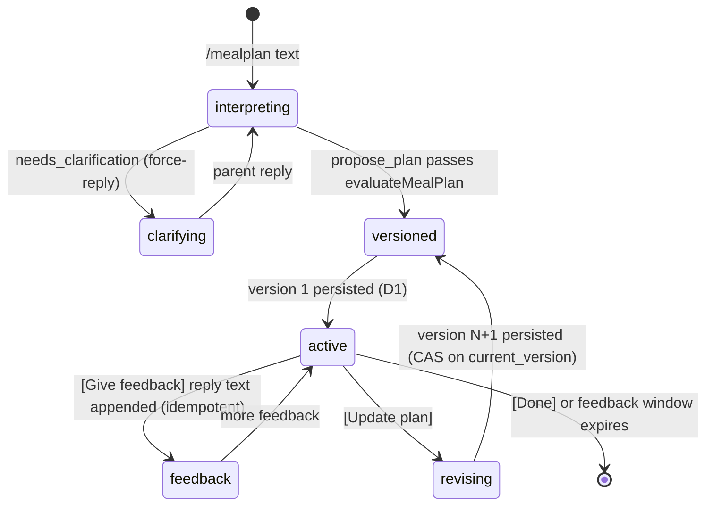

# School-Day Meal Planning — Iteration 1: Telegram-first Workflow

> **Status:** Plan for GitHub issue #65 (parent: #59; prerequisite: #64 corpus/evaluator, merged)
> **Document role:** Design of the first deliverable slice of the School-Day Meal
> Planning workflow: durable D1 contracts, the bounded planning-agent loop wired
> to the deterministic `evaluateMealPlan` evaluator, a Telegram-first
> conversation surface, versioned plan persistence with stale-revision
> rejection, and the #64 corpus as the documented quality gate.

## 1. Goal

Deliver a usable Telegram-first school-week meal-planning workflow. A parent
can start a planning conversation in Telegram text, receive a Monday–Saturday
plan rendered as Telegram text, reply with targeted meal feedback, and receive
a new persisted active-plan version. The active plan and its revision history
survive process restarts as versioned canonical records in Cloudflare D1.

This iteration reuses the already-merged deterministic evaluator and corpus
(#64). It introduces no separate review agent, no Mini App, no voice
transcription, and no multi-bot support — all recorded as out of scope in the
issue.

## 2. Scope and boundary

### In scope

- D1 database binding, migration schema, and a thin typed store for: household
  profile, plan, immutable plan version, feedback batch, agent job, and audit
  records.
- One bounded planning-agent loop with the deterministic `evaluate_meal_plan`
  tool and the agent-owned free-form policy self-validation loop (`satisfied` /
  `trade-off` / `needs-clarification` outcomes). No reviewer agent.
- Telegram-first surface: `/mealplan` to start or continue planning,
  `/plan` to retrieve the active plan during the week, targeted clarification
  via force-reply, and plan review with inline actions (Give feedback /
  Update plan / Done).
- Plan versioning: active plan is versioned; feedback binds to an exact base
  version; stale revisions are rejected; retried submissions are idempotent.
- Deterministic plan rendering as Telegram text (fridge-board equivalent).
- Recipe-video discovery as **optional, non-blocking enrichment** for school
  lunch and home lunch cells; a missing video never removes or blocks a plan.
- The #64 corpus as a documented quality gate, including new agent-level tests
  that drive the loop from corpus scenarios.

### Out of scope (recorded, not built)

- Telegram Mini App review, visual weekly grid, local feedback drafts.
- Multi-bot support (#63), voice-note transcription (#61).
- A separate reviewer agent (explicitly excluded by the planning-decisions
  document).
- Persistent-profile editing UX (an open product decision in the spec); the
  initial household profile is seeded, not editable in this iteration.
- Grocery ordering, inventory tracking, shopping support.
- D1 backup/export automation, dashboards, or usage metrics beyond
  `logRuntime` + the `agent_job` table.

## 3. Architecture

Mirror the proven Calendar shape (bounded agent session, deterministic
evaluator, durable workflow, interaction router). D1 is the long-term store;
the Workflow coordinates one planning conversation and revision turns.

```text
triggers/telegram-webhook.ts
  ├─ /mealplan <text> ──▶ MealPlanningWorkflow.create({ chatId, requestKind:"initial_plan", requestText })
  ├─ /plan            ──▶ read active plan from D1, render, send (no agent)
  └─ routed interactions (kind meal-*) ──▶ MealPlanningWorkflow instance events

meal-planning/workflow.ts            WorkflowEntrypoint → agent-workflow runner
meal-planning/agent-workflow.ts      bounded turn loop: session, clarifications,
                                     persistence, plan send, feedback window, revision
agent/meal-planning-session.ts       bounded tool session (mirrors calendar-session)
agent/meal-planning.ts               static zod tool definitions:
                                       evaluate_meal_plan, propose_plan, needs_clarification
meal-planning/evaluation.ts          evaluateMealPlan(candidate, context)  [exists, reused]
meal-planning/types.ts               MealPlanContext, MealPlanCandidate, ...  [exists]
meal-planning/coverage.ts            coverage set  [exists]
meal-planning/store.ts               D1 client: profile, plan, plan_version,
                                     feedback_batch, agent_job, meal_audit (+ seed profile)
meal-planning/messages.ts            MEAL_HELP, renderPlanMessage, fixed notices
meal-planning/video.ts               optional YouTube enrichment, never blocking
core/interaction-router.ts           per-chat opaque routing [exists, reused]
```

Dependency direction matches `docs/architecture/modules.md`: triggers → workflow
→ agent → (meal-planning domain, providers, runtime, integrations, router, D1
store). The store is the only module that touches the D1 binding.

### State lifecycle



The planning conversation lives inside one workflow instance for a bounded
feedback window (default 48 h, configurable). After the window expires the
instance ends; the active plan and history remain readable from D1 via `/plan`.

## 4. Durable contracts (D1)

One database `MEAL_PLANNING_DB` (`d1_databases` binding), migration
`migrations/0001_init.sql`. All JSON columns hold normalized structured data
per `src/meal-planning/types.ts`; no transcripts or raw provider text are
stored (privacy rule inherited from Calendar).

```sql
-- Household profile (single-bot: one row per Telegram chat)
CREATE TABLE meal_profile (
  chat_id TEXT PRIMARY KEY,
  profile_json TEXT NOT NULL,            -- MealProfile
  custom_policies_json TEXT NOT NULL,    -- CustomPolicy[]
  schedule_json TEXT NOT NULL,           -- MealSchedule
  location_json TEXT,                    -- { country, city } | NULL
  version INTEGER NOT NULL DEFAULT 1,
  created_at TEXT NOT NULL, updated_at TEXT NOT NULL
);

-- Plan header: one active plan per chat (previous active → 'replaced')
CREATE TABLE meal_plan (
  plan_id TEXT PRIMARY KEY,
  chat_id TEXT NOT NULL,
  week_start TEXT NOT NULL, week_end TEXT NOT NULL, timezone TEXT NOT NULL,
  status TEXT NOT NULL DEFAULT 'active',            -- active | replaced
  current_version INTEGER NOT NULL DEFAULT 0,
  weekly_inventory_json TEXT NOT NULL DEFAULT '{}', -- week-scoped state
  weekly_exceptions_json TEXT NOT NULL DEFAULT '{}',
  created_at TEXT NOT NULL, updated_at TEXT NOT NULL
);
CREATE INDEX idx_meal_plan_chat ON meal_plan(chat_id, status);

-- Immutable plan versions. No UPDATE statements ever target this table.
CREATE TABLE meal_plan_version (
  plan_id TEXT NOT NULL, version INTEGER NOT NULL,
  candidate_json TEXT NOT NULL,          -- grid + easyBuys + policyOutcomes
  evaluation_json TEXT NOT NULL,         -- failures + measurements
  request_kind TEXT NOT NULL,            -- initial_plan | revision
  base_version INTEGER,                  -- NULL for initial
  feedback_batch_id TEXT,
  video_json TEXT NOT NULL DEFAULT '{}', -- per-cell video results (lunch slots)
  created_at TEXT NOT NULL,
  PRIMARY KEY (plan_id, version)
);

-- Feedback: batched against an exact base version; applied or rejected once
CREATE TABLE feedback_batch (
  batch_id TEXT PRIMARY KEY,
  chat_id TEXT NOT NULL, plan_id TEXT NOT NULL,
  base_version INTEGER NOT NULL,
  items_json TEXT NOT NULL,              -- FeedbackItem[] (stable ids)
  status TEXT NOT NULL DEFAULT 'open',   -- open | applied | rejected
  applied_to_version INTEGER,
  source_update_id INTEGER NOT NULL,     -- Telegram update id → idempotency
  created_at TEXT NOT NULL, applied_at TEXT
);
CREATE UNIQUE INDEX idx_feedback_update ON feedback_batch(chat_id, source_update_id);

-- Agent job: one row per workflow run (outcome + metadata, no transcripts)
CREATE TABLE agent_job (
  job_id TEXT PRIMARY KEY,
  chat_id TEXT NOT NULL, plan_id TEXT,
  request_kind TEXT NOT NULL,
  outcome TEXT NOT NULL,                 -- succeeded | failed | clarification_needed
  failure_reason TEXT, metrics_json TEXT,-- turns, tool calls, tool names, summaries
  workflow_instance TEXT,
  created_at TEXT NOT NULL, completed_at TEXT
);
CREATE INDEX idx_agent_job_chat ON agent_job(chat_id, created_at);

-- Append-only audit
CREATE TABLE meal_audit (
  audit_id INTEGER PRIMARY KEY AUTOINCREMENT,
  chat_id TEXT NOT NULL,
  entity_type TEXT NOT NULL,             -- plan_version | feedback_batch | plan
  entity_id TEXT NOT NULL,
  action TEXT NOT NULL,                  -- created | applied | rejected
  detail_json TEXT, workflow_instance TEXT,
  created_at TEXT NOT NULL
);
CREATE INDEX idx_meal_audit_chat ON meal_audit(chat_id, created_at);

-- Optional video enrichment cache (per #60 spike): 24 h TTL, expired rows deleted on use
CREATE TABLE recipe_video_cache (
  cell_key TEXT PRIMARY KEY,             -- dish:slotId
  status TEXT NOT NULL,                  -- found | no_suitable_video
  url TEXT, title TEXT, channel TEXT,
  fetched_at TEXT NOT NULL, expires_at TEXT NOT NULL
);
```

### Store module (`meal-planning/store.ts`)

`MealPlanningStore` interface with two implementations:

- `createMealPlanningStore(db: D1Database)` — production binding, SQL via
  `prepare/bind/run/first/all`.
- `createInMemoryMealPlanningStore()` — Map-backed fake for unit/integration
  tests (same invariant logic, no SQL).

Invariants enforced at the store layer (deterministic, unit-tested):

- **Immutable versions:** insert-only `meal_plan_version`; a version row is
  never updated.
- **CAS promotion:** a revision persists with
  `UPDATE meal_plan SET current_version = ? WHERE chat_id = ? AND current_version = ?`
  and checks rows affected; a stale writer gets `{ ok: false, reason: "stale" }`
  and no version row is inserted.
- **Feedback idempotency:** unique `(chat_id, source_update_id)` — a retried
  Telegram delivery inserts nothing the second time.
- **Seed profile:** `loadOrCreateProfile(chatId)` inserts the initial household
  configuration (spec §5.11 initial set: Snack policy, Equipment gap, Packing
  capacity, two Nutrition targets) on first use, stored as generic properties +
  custom policies + the five-slot Mon–Sat schedule.

## 5. Planning-agent loop and tools

`agent/meal-planning-session.ts` runs `runTools` (bounded: 3 provider turns /
4 tool calls, `requireHandoff: true`) with a static registry
(`agent/meal-planning.ts`), mirroring the Calendar session. Tools:

| Tool | Input (zod, strict) | Output | Behavior |
| --- | --- | --- | --- |
| `evaluate_meal_plan` | `MealPlanCandidate` (grid, easyBuys, policyOutcomes) | `MealPlanEvaluation` (pass, failures, measurements) | Pure wrapper over `evaluateMealPlan`; tracked as `latestEvaluation` in the session closure |
| `propose_plan` (terminal) | `{ candidate, weeklyInventory, weeklyExceptions, feedbackItems? }` | `{ accepted: true }` | Handler re-runs `evaluateMealPlan` on the submitted candidate with the session context; requires `pass`, else `ToolHandlerError("proposed plan did not pass evaluation")`. For revisions, validates every provided raw feedback text is represented by a scoped `feedbackItems` entry or an outcome rationale (matches `unaddressed_feedback`) |
| `needs_clarification` (terminal) | `{ message, reasonCodes: FailureCode[], interaction: { kind: "reply" } }` | `{ accepted: true }` | Enforces every failure from `latestEvaluation` is included; message cannot expose opaque ids |

Agent self-validation loop (spec §7 / planning-decisions): the agent proposes a
candidate, calls `evaluate_meal_plan`, revises objective failures, self-checks
free-form policy (recording `satisfied` / `trade-off` / `needs-clarification`
with concise rationale — completeness enforced by the evaluator's
`missing_policy_outcome`), then either calls `propose_plan` or asks one
targeted clarification. The system prompt states the rules and the boundary:
the agent owns free-text interpretation and normalization into the canonical
tokens the evaluator checks (exact string membership only); it must clarify
ambiguous exclusions before they become hard constraints.

Unlike Calendar, no opaque plan ledger is needed: the write target is our own
D1 store and the evaluator is pure/replayable, so `propose_plan` carries the
candidate and the handler re-verifies it deterministically.

## 6. Workflow sequence (`meal-planning/workflow.ts` + `agent-workflow.ts`)

`MealPlanningWorkflowParams`:
`{ chatId, telegramMessageId, requestKind: "initial_plan" | "revision", requestText }`.

`runAgentCenteredMealPlanningWorkflow(env, event, step)`:

1. **Load state:** `loadOrCreateProfile(chatId)`; active plan for chat
   (becomes `recentPlan` for variety); pending feedback batch for the active
   plan (revision only).
2. **Session turn loop** (bounded by `MEAL_PLANNING_TTL_MS`, default 30 min per
   interaction):
   - Build `MealPlanContext` (profile, custom policies, weekly inventory/
     exceptions from plan row or conversation, recent plan, request kind,
     feedback items).
   - Run `runMealPlanningAgentSession` in a `step.do`.
   - `needs_clarification` → `promptForReply` (force-reply, kind
     `meal-clarification`) → append reply → next turn.
   - `propose_plan` → persist (below) → break.
   - Agent failure/timeout → `meal-agent-unavailable` notice; record job.
3. **Persist (initial):** create plan row + version 1 + audit + agent job;
   previous active plan → `replaced`. **Persist (revision):** CAS promote
   `current_version`; INSERT immutable version N+1; mark feedback batch
   `applied`; audit; job. CAS failure → `meal-stale-plan` notice, no version
   written.
4. **Optional enrichment:** fill `recipeVideo` for school-lunch and home-lunch
   cells via `video.ts` **before** persisting the version (deterministic gate,
   never blocking; see §8).
5. **Send plan message** (`renderPlanMessage`, Markdown) with inline buttons
   `[Give feedback] [Update plan] [Done]`; register interactions (group
   `"meal-planning"`, `expiresAt = now + MEAL_FEEDBACK_WINDOW_MS`).
6. **Feedback window loop** until absolute deadline (`MEAL_FEEDBACK_WINDOW_MS`,
   default 48 h, env-overridable):
   - `step.waitForEvent("telegram-reply", timeout = remaining)`.
   - `meal-feedback` (reply to force-prompt): append `FeedbackItem` to the open
     batch (idempotent per `source_update_id`); send `meal-feedback-noted`
     notice; continue waiting.
   - `meal-update` (button): run revision session (step 2) with
     `basePlanVersion = current_version`; on success send the new plan message
     with fresh buttons (step 5) and continue; on stale → `meal-stale-plan`
     notice and continue.
   - `meal-done` (button) or timeout: end. The active plan stays in D1.
7. **Retrieval during the week:** `/plan` reads the active plan directly from
   D1 and renders it — no agent, no workflow instance.

Routing (`telegram-webhook.ts`): kinds `meal-*` dispatch to
`MEAL_PLANNING_WORKFLOW`; planning-conversation interactions carry the live
instance id (sendEvent, like Calendar). `/mealplan` with no argument shows
help; `/plan` shows the active plan (or help).

## 7. Telegram surface and rendering

- `/mealplan <context>` — start planning; the agent asks only for
  week-relevant facts (inventory/exceptions) and confirms them in plain
  language before proposing (spec §5.11).
- `/plan` — render the active plan.
- Plan message: compact fridge-board-equivalent, phone-friendly, deterministic
  (`messages.ts`, pure function, snapshot-tested). Per day, five slot lines;
  dish + optional prep label + easy-buy marker; a short pending-feedback
  indicator when the batch is open; material trade-offs summarized from
  `policyOutcomes` (labels only, no essay). Video links shown only when a
  `found` result exists.
- Interaction kinds added to `INTERACTION_KIND`: `meal-clarification`,
  `meal-feedback`, `meal-update`, `meal-done` (all `meal-*` prefixed for
  routing). No new plain-text routing kinds: feedback and clarifications arrive
  as force-reply replies (replyTo resolution), matching the Calendar pattern.

## 8. Optional recipe-video enrichment (`meal-planning/video.ts`)

- Schema: `MealCell.recipeVideo?: { status: "found" | "no_suitable_video" |
  "not_attempted"; url?; title?; channel? }` (types.ts addition).
- Behavior: for school-lunch and home-lunch cells only. When
  `YOUTUBE_API_KEY` is configured, query the YouTube Data API per the #60
  spike design (search.list + videos.list, trusted-channel preference,
  `no_suitable_video` on miss), cache 24 h in `recipe_video_cache`. When the
  key is absent or any step fails, the cell records `no_suitable_video` (or
  `not_attempted`) and the plan proceeds unchanged. Hard ceiling on calls per
  plan; results never gate or alter the plan.
- Iteration 1 keeps the adapter thin and flag-gated; the full #60 remaining
  work (server-side secret binding, rate limiting, cache cleanup) is a
  follow-up.

## 9. Quality gate (#64 corpus)

- Existing suites stay: `meal-planning-corpus.test.ts` (corpus health),
  `meal-planning-evaluation.test.ts` (candidate runner) — `pnpm test`.
- New `meal-planning-agent.test.ts`: drives `runMealPlanningAgentSession` with
  a mocked provider over each corpus scenario's `pass: true` candidates →
  asserts `propose_plan` is accepted and the evaluation passes; for
  `behavior.expectsClarification` scenarios → asserts `needs_clarification`
  with the expected policy outcomes. This makes the corpus the documented gate
  for the planning loop (issue acceptance criterion 5).
- New Telegram e2e (`meal-planning-telegram-workflow.integration.test.ts`):
  webhook → workflow → in-memory store → fake Telegram, covering: full happy
  path (context → plan v1 → feedback → revision → plan v2), stale revision
  rejection (base version < current), retried feedback idempotency, and
  restart survival (a fresh store instance reads the active plan).

## 10. File changes

New:

- `migrations/0001_init.sql` — D1 schema above.
- `src/meal-planning/store.ts` — store interface + D1 impl + in-memory fake + seed profile.
- `src/meal-planning/workflow.ts` — `MealPlanningWorkflow` entrypoint.
- `src/meal-planning/agent-workflow.ts` — runner (session loop, persistence, feedback window, revision).
- `src/meal-planning/messages.ts` — help, `renderPlanMessage`, fixed notices.
- `src/meal-planning/video.ts` — optional enrichment.
- `src/agent/meal-planning.ts` — tool definitions + zod schemas.
- `src/agent/meal-planning-session.ts` — bounded session.
- `src/__tests__/meal-planning-store.test.ts`, `meal-planning-messages.test.ts`,
  `meal-planning-agent.test.ts`.
- `src/__integration__/meal-planning-telegram-workflow.integration.test.ts`.

Modified:

- `wrangler.toml` — `[[d1_databases]]` binding `MEAL_PLANNING_DB`,
  `[[workflows]]` binding `MEAL_PLANNING_WORKFLOW`, optional `YOUTUBE_API_KEY` var.
- `src/core/types.ts` — `Env` additions (`MEAL_PLANNING_DB: D1Database`,
  `MEAL_PLANNING_WORKFLOW: Workflow`, `YOUTUBE_API_KEY?`), `INTERACTION_KIND` meal kinds.
- `src/triggers/telegram-webhook.ts` — `/mealplan`, `/plan` commands; `meal-*` dispatch.
- `src/index.ts` — export `MealPlanningWorkflow`.
- `src/meal-planning/types.ts` — `MealCell.recipeVideo` (optional).
- `docs/architecture/architecture.yaml`, `data-and-state.md`, `modules.md`,
  `request-flows.md` — per ADR-001 (D1 store, meal-planning workflow module,
  Telegram commands).

## 11. Validation

```bash
pnpm typecheck
pnpm lint            # biome check src/
pnpm run docs        # tools/require-jsdoc.mjs (JSDoc on all new exported functions)
pnpm test            # unit: store, messages, agent, evaluator + corpus suites
pnpm test:integration
```

`lefthook` pre-commit runs typecheck, lint, and both test suites. The plan
commit itself is documentation-only and does not touch `src/`.

## 12. Follow-ups (separate issues)

- Long-lived midweek feedback window after the conversation deadline (new
  instance per feedback event, `createBatch`-seeded per chat).
- Profile-editing conversation (open product decision).
- #60 remaining production work: YouTube secret binding, rate limiting,
  cache cleanup, refresh policy.
- D1 backup/export automation and read/write metrics (feasibility guardrails).

## 13. Open questions

None blocking. Notes for review:

1. Feedback window default of 48 h (env-overridable) keeps one workflow
   instance alive per conversation; a longer window means a longer-lived
   instance, which is free on Cloudflare Workflows but extends interaction
   registrations.
2. Weekly inventory/exceptions live on the `meal_plan` row (week-scoped
   state, per spec §5.11); they expire when a new plan replaces the row.
