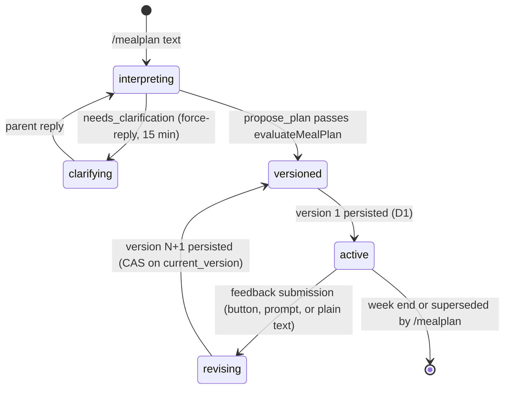

# School-Day Meal Planning — Iteration 1: Telegram-first Workflow

> **Status:** Plan for Bead `agent-harness-znw` (GitHub issue #65; parent: #59; prerequisite: #64 corpus/evaluator, merged)
> **Document role:** Design of the first deliverable slice of the School-Day Meal
> Planning workflow: durable D1 contracts, the bounded planning-agent loop wired
> to the deterministic `evaluateMealPlan` evaluator, a Telegram-first
> conversation surface, versioned plan persistence with stale-revision
> rejection, and the #64 corpus as the documented quality gate.

## 1. Goal

Deliver a usable Telegram-first school-week meal-planning workflow. A parent
can start a planning conversation in Telegram text, receive a Monday–Saturday
plan rendered as Telegram text, reply with targeted meal feedback, and receive
a new persisted active-plan version. The active plan and its revision history
survive process restarts as versioned canonical records in Cloudflare D1.

This iteration reuses the already-merged deterministic evaluator and corpus
(#64). It introduces no separate review agent, no Mini App, no voice
transcription, and no multi-bot support — all recorded as out of scope in the
issue.

## 2. Scope and boundary

### In scope

- D1 database binding, migration schema, and a thin typed store for: household
  profile, plan, immutable plan version, and feedback batch records.
- One bounded planning-agent loop with the deterministic `evaluate_meal_plan`
  tool and the agent-owned free-form policy self-validation loop (`satisfied` /
  `trade-off` / `needs-clarification` outcomes). No reviewer agent.
- Telegram-first surface: `/mealplan` to start or continue planning,
  targeted clarification via force-reply, and plan review with one inline
  action (Give feedback). No `/plan` command: mid-week retrieval
  of the active plan is the iteration-2 mini-app's home view, and iteration-1
  tests read the store directly (see §13.3).
- Default-approval plan lifecycle: a created plan is approved as-is; a
  feedback submission (Telegram force-reply today, mini-app in iteration 2)
  triggers a revision that creates a new plan version.
- Plan versioning: active plan is versioned; a feedback submission is
  recorded as an immutable batch linked to the version it drove; stale
  revisions are rejected; retried deliveries are idempotent (router
  single-claim).
- Deterministic plan rendering as Telegram text (fridge-board equivalent).
- Recipe-video discovery as **optional, non-blocking enrichment** for school
  lunch and home lunch cells; a missing video never removes or blocks a plan.
- The #64 corpus as a documented quality gate, including new agent-level tests
  that drive the loop from corpus scenarios.

### Out of scope (recorded, not built)

- Telegram Mini App review, visual weekly grid, local feedback drafts.
- Multi-bot support (#63), voice-note transcription (#61).
- A separate reviewer agent (explicitly excluded by the planning-decisions
  document).
- Persistent-profile editing UX (an open product decision in the spec); the
  initial household profile is seeded, not editable in this iteration.
- Grocery ordering, inventory tracking, shopping support.
- D1 backup/export automation, dashboards, or usage metrics beyond
  `logRuntime` (durable per-workflow usage metrics for all workflows are
  tracked separately — backlog `agent-harness-fuc`).

## 3. Architecture

Mirror the proven Calendar shape (bounded agent session, deterministic
evaluator, durable workflow, interaction router). D1 is the long-term store;
the Workflow coordinates one planning conversation and revision turns.

```text
triggers/telegram-webhook.ts
  ├─ /mealplan <text> ──▶ MealPlanningWorkflow.create({ chatId, requestText, invokedAtMs })
  └─ routed interactions (kind meal-*) ──▶ MealPlanningWorkflow instance events

meal-planning/workflow.ts            WorkflowEntrypoint → agent-workflow runner
meal-planning/agent-workflow.ts      bounded turn loop: session, clarifications,
                                     persistence, plan send, live week loop, revision
agent/meal-planning-session.ts       bounded tool session (mirrors calendar-session)
agent/meal-planning.ts               static zod tool definitions:
                                       evaluate_meal_plan, propose_plan, needs_clarification
meal-planning/evaluation.ts          evaluateMealPlan(candidate, context)  [exists, reused]
meal-planning/types.ts               MealPlanContext, MealPlanCandidate, ...  [exists]
meal-planning/coverage.ts            coverage set  [exists]
meal-planning/store.ts               D1 client: profile, plan, plan_version,
                                     feedback_batch (+ seed profile)
meal-planning/messages.ts            MEAL_HELP, renderPlanMessage, fixed notices
meal-planning/video.ts               optional YouTube enrichment, never blocking
core/interaction-router.ts           per-chat opaque routing [exists, extended: chat-scoped generation]
```

Dependency direction matches `docs/architecture/modules.md`: triggers → workflow
→ agent → (meal-planning domain, providers, runtime, integrations, router, D1
store). The store is the only module that touches the D1 binding.

### State lifecycle



One workflow instance lives per chat-week: it is created by `/mealplan`,
stays alive until the plan's `week_end` (or until a fresh `/mealplan`
supersedes it), and handles initial planning plus every feedback submission
for that week's plan (a submission arrives via the `[Give feedback]` button,
its force-reply prompt, or plain text in the chat). A created plan is approved by
default; conversation continuity across revisions comes from the instance's
durable step state (the Calendar pattern), never from D1 transcripts (privacy
rule). The active plan and version history remain readable from D1 (the
iteration-2 mini-app reads the same `activePlan` store contract).

## 4. Durable contracts (D1)

One database `MEAL_PLANNING_DB` (`d1_databases` binding), migration
`migrations/0001_init.sql`. All JSON columns hold normalized structured data
per `src/meal-planning/types.ts`; no transcripts or raw provider text are
stored (privacy rule inherited from Calendar). All timestamps are ISO-8601
UTC at fixed precision (`created_at`, `updated_at`, `week_start`,
`week_end`); `week_end > ?` comparisons are lexical, so writers must emit the
identical format.

```sql
-- Household profile (single-bot: one row per Telegram chat)
CREATE TABLE meal_profile (
  chat_id TEXT PRIMARY KEY,
  profile_json TEXT NOT NULL,            -- MealProfile
  custom_policies_json TEXT NOT NULL,    -- CustomPolicy[]
  schedule_json TEXT NOT NULL,           -- MealSchedule
  location_json TEXT,                    -- { country, city } | NULL
  interaction_generation INTEGER NOT NULL DEFAULT 0, -- chat-scoped plan-message generation (§6)
  version INTEGER NOT NULL DEFAULT 1,
  created_at TEXT NOT NULL, updated_at TEXT NOT NULL
);

-- Plan header: one active plan per chat (previous active → 'replaced')
CREATE TABLE meal_plan (
  plan_id TEXT PRIMARY KEY,
  chat_id TEXT NOT NULL,
  week_start TEXT NOT NULL, week_end TEXT NOT NULL, timezone TEXT NOT NULL,
  instance_id TEXT NOT NULL,              -- live Workflow instance id (the webhook's fallthrough pointer, §6)
  status TEXT NOT NULL DEFAULT 'active',            -- active | replaced
  current_version INTEGER NOT NULL DEFAULT 0,
  weekly_inventory_json TEXT NOT NULL DEFAULT '{}', -- week-scoped state
  weekly_exceptions_json TEXT NOT NULL DEFAULT '{}',
  created_at TEXT NOT NULL, updated_at TEXT NOT NULL
);
CREATE INDEX idx_meal_plan_chat ON meal_plan(chat_id, status);

-- Exactly one active plan per chat, enforced by the database. A concurrent
-- second active INSERT fails atomically (whole batch rolls back).
CREATE UNIQUE INDEX idx_meal_plan_one_active ON meal_plan(chat_id) WHERE status = 'active';

-- Immutable plan versions. No UPDATE statements ever target this table.
CREATE TABLE meal_plan_version (
  plan_id TEXT NOT NULL, version INTEGER NOT NULL,
  candidate_json TEXT NOT NULL,          -- grid + easyBuys + policyOutcomes
  evaluation_json TEXT NOT NULL,         -- failures + measurements
  request_kind TEXT NOT NULL,            -- initial_plan | revision
  base_version INTEGER,                  -- NULL for initial
  feedback_batch_id TEXT,          -- batch that drove this version (NULL only for the initial plan)
  video_json TEXT NOT NULL DEFAULT '{}', -- per-cell video results (lunch slots)
  created_at TEXT NOT NULL,
  PRIMARY KEY (plan_id, version)
);

-- Feedback submission record: one immutable batch per feedback-driven
-- revision, created atomically with the version it drove (promotePlanVersion).
-- No lifecycle (no status transitions), no accumulation — a submission is
-- consumed by the revision it triggers. The initial plan has no batch.
CREATE TABLE feedback_batch (
  batch_id TEXT PRIMARY KEY,             -- plan_id || ':v' || newVersion
  plan_id TEXT NOT NULL,
  base_version INTEGER NOT NULL,         -- the version the feedback targeted
  items_json TEXT NOT NULL,              -- FeedbackItem[] as submitted
  created_at TEXT NOT NULL
);
```

### Store module (`meal-planning/store.ts`)

`MealPlanningStore` interface with two implementations:

- `createMealPlanningStore(db: D1Database)` — production binding, SQL via
  `prepare/bind/run/first/all`.
- `createInMemoryMealPlanningStore()` — Map-backed fake for unit/integration
  tests (same invariant logic, no SQL).

Invariants enforced at the store layer (deterministic, unit-tested):

- **One active plan per chat, by construction:** the partial unique index
  `idx_meal_plan_one_active` rejects any insert of a second active row that did
  not first supersede its predecessor (it is the database-level invariant; the
  in-memory fake enforces the same rule). Week semantics: an explicit
  `/mealplan` always creates a new active plan and atomically supersedes the
  previous active row in the same batch, **even when the target week differs**
  (a Thursday `/mealplan` targets next week and replaces this week's plan —
  one active plan per chat, per the product ruling; there are never two live
  plans). The superseded plan stays readable in
  `meal_plan_version` history (feedback about a superseded plan is discarded
  with it — its message's buttons are generation-invalidated, §6); the parent
  is told the previous plan was replaced. **Documented shortcoming
  (iteration 1):** planning a later week before the current week ends removes
  the current week's plan from the active surface — the parent loses in-chat
  access to the superseded week's plan; D1 keeps the history, and the
  iteration-2 mini-app home view can surface past weeks.
- **Immutable versions:** insert-only `meal_plan_version`; a version row is
  never updated or deleted.
- **Atomic create-active-plan (initial):** one `db.batch` of
  1. `UPDATE meal_plan SET status = 'replaced', updated_at = ? WHERE chat_id = ? AND status = 'active'`
  2. `INSERT INTO meal_plan (plan_id, chat_id, week_start, week_end, timezone, instance_id, status, current_version, ...) VALUES (?, ?, ?, ?, ?, ?, 'active', 1, ...)` — `instance_id` = `event.instanceId` (the webhook's fallthrough pointer, §6)
  3. `INSERT INTO meal_plan_version (plan_id, version, ...) VALUES (?, 1, ...)`
  4. `UPDATE meal_profile SET interaction_generation = interaction_generation + 1 WHERE chat_id = ?`
  5. `SELECT interaction_generation FROM meal_profile WHERE chat_id = ?` — returns this plan message's generation (used for the action registrations in step 5 of §6)
  D1 batch is a single transaction: **either the whole new plan exists (active
  row + version 1 + the bumped generation) and the previous active row is
  atomically replaced — or nothing changes** — any statement failure rolls back
  the entire batch (no orphan version row, no half-replaced state, no orphan
  generation bump).
  **Concurrency semantic is deliberately serialize-and-supersede**, matching
  spec §2: a second `/mealplan` batch that commits after the first likewise
  replaces the first batch's fresh active row (its supersede-UPDATE matches it
  because it is still `active`), so its INSERT never violates the partial
  index. The `plan-already-active` rejection cannot arise from this SQL and is
  not part of the design; there is no atomic compare/insert guard. The caller
  reads statement 1's `meta.changes` — `0` → first plan for the chat (no
  notice); `>= 1` → a previous active plan was replaced and the parent gets a
  "previous plan replaced" notice. Two concurrent starts simply resolve
  last-commit-wins; the superseded plan stays readable in version history and
  any button on its stale message routes to a replaced plan (revision returns
  `stale`, §6).
- **Atomic revision promotion (`plan_id`-scoped):** one `db.batch` of, in
   order (`oldVersion` = the CAS base the caller believes is current,
   `newVersion` = `oldVersion + 1`; `batchId` =
   `plan_id || ':v' || newVersion` — NULL only defensively: every revision in
   this design is submission-driven, so a NULL `batchId` (statement 5 no-op)
   is retained as cheap insurance, not a designed path):
  1. `INSERT INTO meal_plan_version (plan_id, version, candidate_json, evaluation_json, request_kind, base_version, feedback_batch_id, video_json, created_at) SELECT ?, ?, ?, ?, 'revision', ?, ?, ?, ? FROM meal_plan WHERE plan_id = ? AND current_version = oldVersion AND status = 'active'`
  2. `UPDATE meal_profile SET interaction_generation = interaction_generation + 1 WHERE chat_id = ? AND EXISTS (SELECT 1 FROM meal_plan WHERE plan_id = ? AND current_version = oldVersion AND status = 'active')` — the generation bump, guarded on the CAS base like everything else
  3. `SELECT interaction_generation FROM meal_profile WHERE chat_id = ?` — returns this plan message's generation (used only when the caller sees success)
   4. `UPDATE meal_plan SET weekly_inventory_json = ?, weekly_exceptions_json = ?, updated_at = ? WHERE plan_id = ? AND current_version = oldVersion AND status = 'active'` — the week-scoped inventory/exceptions refresh (the revision session's captured values, §6 step 2); skipped when the session submitted no changes; CAS-guarded on the base like statements 1–2 (a stale call changes nothing)
   5. `UPDATE meal_plan SET current_version = newVersion, updated_at = ? WHERE plan_id = ? AND current_version = oldVersion AND status = 'active'`
   6. `INSERT OR IGNORE INTO feedback_batch (batch_id, plan_id, base_version, items_json, created_at) SELECT ?, plan_id, ?, ?, ? FROM meal_plan WHERE plan_id = ? AND current_version = newVersion AND status = 'active' AND ? IS NOT NULL` — records the submission that drove this revision; a NULL `batchId` matches 0 rows (retained defensively — every revision is submission-driven)
   **Every statement is conditional on a successful promotion.** Statements 1–2
   and 4–5 no-op via the CAS base guard (`current_version = oldVersion` — the
   bump's `EXISTS` reads the plan row before statement 5 advances it, so a
   stale call never bumps the generation), and statement 6's
   `current_version = newVersion` guard can only match *after* statement 5 has
   advanced the row. Order therefore matters, and a stale call changes nothing:
   1–2 and 4 no-op on the CAS base; 5 no-ops on the CAS base; 6 no-ops because
   `current_version ≠ newVersion` (or the plan is no longer `active`).
   Statement 3 is a read the caller ignores on stale. The one deliberate
   exception is the same-target race: two concurrent revisions from the same
   base both compute the same `newVersion`; when the loser runs after the
   winner, statements 1–2 and 4 match 0 rows (the winner already advanced past
   `oldVersion`), and 6's SELECT matches the winner's advanced row with the
   same `batchId` — `INSERT OR IGNORE` absorbs the winner's batch row as a
   clean no-op instead of a PK-constraint error.
   `meal-planning-store.test.ts` asserts **all writes are unchanged on a
   stale call** (no version row, generation unmoved, `current_version` unmoved,
   inventory/exceptions unmoved, no feedback batch row).
   **One defined atomic outcome:** the new version row, the `current_version`
   advance, the generation bump, the week-scoped inventory/exceptions refresh,
   and (for feedback-driven revisions) the
  feedback batch row all commit or all roll back together. `plan_id` is the PK
  and `status = 'active'` is guarded, so the batch can never promote more than
  one row or a replaced plan. Concurrent same-base revisions serialize on the
  transaction; the loser's SELECT matches 0 rows.
  **Post-batch diagnostics (recovery defined):** the caller gates on statement
  1's `meta.changes` — `1` → success; `0` → `{ ok: false, reason: "stale" }`.
  On stale, no compensation is needed (nothing changes — this is the point of
  the CAS guard) and the caller sends `meal-stale-plan` and logs the event via
  `logRuntime` (`event: "meal-plan-promotion", outcome: "stale"`), the
  ephemeral structured-log pattern the other workflows use for every event.
  No separate audit table exists: this is a single-household consumer
  workflow, so committed transitions are recorded by the domain tables
  themselves (`meal_plan_version.created_at`,
  `feedback_batch.created_at`), non-events like a stale attempt go to runtime
  logs, and durable per-workflow metrics are the separate backlog item
  `agent-harness-fuc`.
- **Feedback submission records:** a feedback submission is one immutable
  `feedback_batch` row (the items as submitted), created atomically with the
  revision version it drove and linked from it via
  `meal_plan_version.feedback_batch_id`. There is no append path, no
  open/applied/rejected lifecycle, and no accumulation — a submission is
  consumed by exactly one revision. Delivery idempotency is the router's
  durable single-claim on `consumed_update_id` / `callbackToken` (§6): a
  retried delivery of the same update resolves to `{ interaction: null }` and
  never reaches the store.
- **Seed profile:** `loadOrCreateProfile(chatId)` inserts the initial household
  configuration (spec §5.11 initial set: Snack policy, Equipment gap, Packing
  capacity, two Nutrition targets) on first use, stored as generic properties +
  custom policies + the five-slot Mon–Sat schedule.

The in-memory fake mirrors the same operations and result semantics
(`ok`/`reason: "stale"`, one-active constraint, insert-only versions,
immutable submission batches linked to versions) so the unit and integration
suites exercise identical invariants without SQL.

## 5. Planning-agent loop and tools

`agent/meal-planning-session.ts` runs `runTools` (bounded: 3 provider turns /
4 tool calls, `requireHandoff: true`) with a static registry
(`agent/meal-planning.ts`), mirroring the Calendar session. Tools:

| Tool | Input (zod, strict) | Output | Behavior |
| --- | --- | --- | --- |
| `evaluate_meal_plan` | `MealPlanCandidate` (grid, easyBuys, policyOutcomes) | `MealPlanEvaluation` (pass, failures, measurements) | Pure wrapper over `evaluateMealPlan`; tracked as `latestEvaluation` in the session closure |
| `propose_plan` (terminal) | `{ candidate, weeklyInventory, weeklyExceptions, feedbackItems? }` | `{ accepted: true }` | Handler re-runs `evaluateMealPlan` on the submitted candidate with the session context; requires `pass`, else `ToolHandlerError("proposed plan did not pass evaluation")`. For revisions, validates every provided raw feedback text is represented by a scoped `feedbackItems` entry or an outcome rationale (matches `unaddressed_feedback`) |
| `needs_clarification` (terminal) | `{ message, reasonCodes: FailureCode[], interaction: { kind: "reply" } }` | `{ accepted: true }` | Enforces every failure from `latestEvaluation` is included; message cannot expose opaque ids |

Agent self-validation loop (spec §7 / planning-decisions): the agent proposes a
candidate, calls `evaluate_meal_plan`, revises objective failures, self-checks
free-form policy (recording `satisfied` / `trade-off` / `needs-clarification`
with concise rationale — completeness enforced by the evaluator's
`missing_policy_outcome`), then either calls `propose_plan` or asks one
targeted clarification. The system prompt states the rules and the boundary:
the agent owns free-text interpretation and normalization into the canonical
tokens the evaluator checks (exact string membership only); it must clarify
ambiguous exclusions before they become hard constraints.

For revisions, the context carries the submitted `FeedbackItem[]`: an item
with a cell `id` is scoped to that cell (the revision must address it there —
the coverage validation on `propose_plan` requires every item be represented);
an unbound item (iteration-1 Telegram text) is interpreted against the plan as
a whole. Feedback is **plan-scoped** in iteration 1: a revision never updates
the profile or custom policies ("we don't eat paneer anymore" fixes the week
only). Profile/policy learning waits for Kipp's learning/memory work (the
existing "profile-editing conversation" follow-up).

Unlike Calendar, no opaque plan ledger is needed: the write target is our own
D1 store and the evaluator is pure/replayable, so `propose_plan` carries the
candidate and the handler re-verifies it deterministically.

## 6. Workflow sequence (`meal-planning/workflow.ts` + `agent-workflow.ts`)

`MealPlanningWorkflowParams`:
`{ chatId, telegramMessageId, requestText, invokedAtMs }` — `invokedAtMs` is the
webhook-captured invocation instant consumed by `resolvePlanningWeek` for
deterministic, replay-safe week selection.

**Submission payload (canonical, identical in iteration 1 and 2):** feedback
arrives as one JSON object `{ items: FeedbackItem[] }` with
`FeedbackItem = { id, text }`. The mini-app (iteration 2) sends this over HTTP
via `feedback-submit` with cell-bound ids; Telegram text is coerced into the
same shape at the boundary by `coerceSubmission(text, source, messageId)`
(`submissions.ts`, pure function, unit-tested): the whole message becomes one
unbound item `{ id: "tg-<messageId>", text }`. Everything downstream — session
context, `propose_plan` validation, the `feedback_batch` row, the version
chain — consumes only this payload shape, so iteration 2 swaps the Telegram
producer for the mini-app producer with no pipeline change. Multi-item
cell-mapped batches cannot enter through Telegram (text transport), so they
are exercised by constructing the payload directly in tests (§9); manual QA
drives the real path with real text (§13.3).

`runAgentCenteredMealPlanningWorkflow(env, event, step)`:

1. **Load state:** `loadOrCreateProfile(chatId)`; resolve the target week —
   `resolvePlanningWeek(invokedAtMs, profile.timezone, requestText)`
   ("Planning-week selection" below); active plan for chat (becomes
   `recentPlan` for variety); the active plan's latest version
   (candidate/evaluation feed the revision context).
2. **Session turn loop** (bounded by `MEAL_PLANNING_TTL_MS`, default 30 min per
   interaction):
   - Build `MealPlanContext` (profile, custom policies, weekly inventory/
     exceptions from plan row or conversation, recent plan, session kind,
     submitted feedback items when a revision is feedback-driven). For
     revisions, the context marks elapsed days (before today) as consumed:
     the agent keeps their dishes unchanged unless the submitted feedback
     explicitly targets them, and applies changes from today onward
     (prompt-level instruction, exercised in the corpus).
   - Run `runMealPlanningAgentSession` in a `step.do`.
   - `needs_clarification` → `promptForReply` (force-reply, kind
     `meal-clarification`, registered **without** a generation — it precedes
     any plan message, so no plan-message generation exists to attach; its
     invalidation is the normal single-claim + expiry). The reply interaction
     expires after **15 min** (`MEAL_CLARIFICATION_TTL_MS`, matching the other
     workflows' interaction lifetime): the session is blocked while a
     clarification is pending, so timeout is a defined outcome — initial
     planning → `meal-planning-canceled` notice ("no reply received; run
     /mealplan to retry") and the instance ends; revision → the revision is
     abandoned, the previous version stands, and the parent gets a
     `meal-feedback-not-applied` notice ("no reply received — your feedback
     was not applied; tap [Give feedback] to try again"). On reply → next
     turn. The
     wait filters by `payload.interactionId`: a `telegram-reply` for a
     different interaction (e.g., a `[Give feedback]` tap on a still-live
     plan message while the session is mid-flight) is discarded and the wait
     resumes with the remaining time — a foreign event is never misread as
     the clarification answer.
   - `propose_plan` → enrich (below) → break.
   - Agent failure/timeout → `meal-agent-unavailable` notice.
3. **Optional enrichment:** fill `recipeVideo` for school-lunch and home-lunch
   cells via `video.ts` **before** persisting the version (deterministic gate,
   never blocking; see §8) — the version row is insert-only, so enrichment
   must precede the persist batch.
4. **Persist:** initial → `createActivePlan` (atomic batch, §4); revision →
   `promotePlanVersion` (`plan_id`-scoped atomic batch, §4; when the revision
   was triggered by a feedback submission, the batch also writes the
   immutable submission batch row and links it from the version). Each batch
   makes the plan/version state changes one atomic outcome and bumps the
   chat-scoped plan message generation (returned to the caller for step 5).
   **No-change revisions skip promotion entirely:** when the submitted
   candidate's grid + easyBuys are identical to the base version's (compared
   deterministically — `policyOutcomes` and video enrichment legitimately
   differ between otherwise-identical candidates), no version row, generation
   bump, or new plan message is produced: the session sends a
   `meal-no-changes` notice ("No changes — your feedback is noted") and the
   loop continues.
    Promotion failure (stale) → `meal-stale-plan` notice, no version written,
    stale event logged via `logRuntime` (§4 recovery).
5. **Send plan message** (`renderPlanMessage`, Markdown) with inline button
   `[Give feedback]`; in one durable `step.do` register one callback
   interaction (group `"meal-planning"`, `expiresAt = weekEnd` —
   the plan row's `week_end`, not a feedback window: a plan is approved by
   default and its button stays live until the week ends or the plan is
   superseded, `generation: <planGeneration>`):
   - `{ interactionId, version: <planVersion>, workflowId: instanceId, kind:
     meal-feedback, callbackToken, botMessageId: planMessageId }`
   `version` binds the buttons to the plan version the parent is looking at;
   the branch uses it only as a staleness guard — if `interaction.version` is
   below the store's current version at event processing, the tap targeted an
   outdated plan message and the branch sends `meal-stale-plan` instead of
   opening the prompt (the revision itself always bases on the store's current
   version, never on the button's). `planGeneration` is the value returned by
   the persistence batch (§4 — createActivePlan statements
   4–5, promotePlanVersion statements 2–3): a chat-scoped monotonic counter
   that every persisted plan message (initial or revision) increments exactly
   once, atomically with its own version rows.
   **Chat-scoped generation invalidation:** every post-persist meal-planning
   registration (action sets here, the `meal-feedback-reply` force-reply
   prompt in step 6) carries the generation of the plan message it belongs
   to. The router tags each row with it, deletes every unconsumed row in the
   group with a *lower* generation at registration time, and on resolve
   returns `{ interaction: null }` for any row below the group's highest
   present generation. Because the counter is per chat and increments per
   plan message (not per plan or version), a fresh `/mealplan` that replaces
   a distinct plan bumps past the old plan's registrations even when both
   plans are at version 1 — the old plan's action buttons and any pending
   `meal-feedback-reply` prompt resolve nothing after the successor
   registers, for revisions and for a newer `/mealplan` alike. A superseded
   instance's registration that lands late still carries its own (lower)
   plan message generation, so it can never invalidate the successor's
   buttons and its own rows resolve null. Pre-persist clarification prompts
   carry no generation (they precede any plan message) and are invalidated
   by single-claim + expiry alone. Calendar registrations carry no generation
   and keep the existing version-based cleanup.
6. **Live week loop** until `week_end` (the plan row's `week_end`) or until a
   fresh `/mealplan` supersedes the plan. One wait on the repo's proven
   single-type `step.waitForEvent("telegram-reply", timeout = remaining)`;
   every producer (button tap, force-reply text, webhook fallthrough,
   iteration-2 API) sends that same event type and the loop dispatches on the
   payload's `interactionKind` (the event type is a transport channel; the
   payload discriminates — no multi-event API dependency):

   | Event kind | Source | Branch (all sends/registers inside `step.do`) |
   | --- | --- | --- |
   | `meal-feedback` | inline-button callback, one-time | Staleness guard first: if `interaction.version < current_version`, send `meal-stale-plan` notice and continue waiting (the tap targeted an outdated plan message). Otherwise `promptForFeedbackReply`: send force-reply prompt `"Reply with your feedback for this plan (e.g. 'Wed lunch: too oily')."` via `step.do`; register one reply interaction `{ interactionId, version: <planVersion>, workflowId: instanceId, kind: "meal-feedback-reply", botMessageId: promptMessageId, expiresAt: <interaction lifetime — 15 min, as clarifications>, interactionGroup: "meal-planning", generation: <planGeneration> }`. Continue waiting. |
    | `meal-feedback-reply` | force-reply text (replyTo the prompt) | The reply **is a feedback submission**: `coerceSubmission(text, "telegram-reply", messageId)` → one unbound `FeedbackItem`. Run the revision session (step 2) with the item as context; persist via `promotePlanVersion` (feedback-driven → submission batch row written and linked, §4; a grid-identical no-change revision sends `meal-no-changes` instead, step 4); send the new plan message with a fresh button + register a new action set (step 5). Stale → `meal-stale-plan` notice. Continue waiting. |
   | `meal-feedback-submission` | `telegram-reply` event with `interactionKind: "meal-feedback-submission"`: webhook fallthrough (level 3) or iteration-2 mini-app API (future; event seam defined now) | Same as `meal-feedback-reply`: a submission — coerced from raw text by the fallthrough, or already structured (`items: FeedbackItem[]`) by the mini-app. No store, session, or version-chain change is needed to add the mini-app producer. |
   | anything else | a `telegram-reply` whose `interactionKind` is not recognized (e.g., a late `meal-clarification` reply that lost its session wait) | Log + re-wait (ignore). |
   | timeout | `waitForEvent` deadline = `week_end` | End. The active plan stays in D1, approved by default. |

   **Parked receive-wait, not a session wait:** no agent session or LLM runs
   while the loop waits — the instance parks because Workflows delivers
   events only to a live `waitForEvent`, and the week-long contracts (the
   `[Give feedback]` button, the level-3 fallthrough, the iteration-2 API)
   must all be able to reach it until `week_end` (idle instances cost
   nothing). The 15-min waits (clarification, feedback prompt) are the
   session-side "agent sought input" waits; this week-end wait is liveness
   for event receipt. Implementation must verify the runtime's
   `waitForEvent` timeout cap (the repo only uses 15-min waits); if capped,
   re-wait in chunks (e.g., 24 h), re-checking `week_end` each cycle — same
   semantics.

   **Duplicate and stale handling** (deterministic, no LLM):
   - The router claims each interaction once by `consumed_update_id` /
     `callbackToken`; a Telegram retry of the same update id resolves to
     `{ interaction: null }` and is logged `ignored` at the webhook — a
     duplicate button tap or duplicate reply can never re-enter the loop.
   - A second, different reply to the same force-reply prompt resolves nothing
     (the only interaction bound to that `botMessageId` is already consumed,
     and the first reply already triggered its revision), so a stray second
     reply is ignored.
   - The `meal-feedback` button branch is one-shot by construction: the tap
      consumed its callback interaction, and the follow-up text arrives on the
      new `meal-feedback-reply` interaction.
   - A tap resolved against an outdated message (its `interaction.version` is
      below the store's current version) is not a duplicate — it is a stale
      target: the `meal-feedback` branch sends `meal-stale-plan` instead of
      opening the prompt, so feedback is never silently applied to the wrong
      plan version.
   - A `[Give feedback]` tap that lands while a session (initial or revision)
      is mid-flight is consumed by the router's single-claim and delivered to
      the instance, where the session's interactionId-filtered wait discards
      it (step 2) — the tap is silently dropped; the parent re-taps after the
      new plan message lands. The window is bounded by the 15-min
      clarification / 30-min session TTL. The same applies to a **reply** to a
      pending feedback prompt that lands mid-session: it is consumed and
      discarded, and the parent cannot re-reply (the router bound one
      interaction to that prompt's `botMessageId`, already consumed — a second
      reply resolves null); they re-tap `[Give feedback]` for a fresh prompt
      and re-type.
   - Expired (`week_end` passed) or generation-invalidated buttons resolve
      null silently: the webhook answers the callback (spinner clears) and
      nothing else happens — no notice. The actionable surface is the newest
      plan message or a fresh `/mealplan`.
   - An event that arrives at or after `week_end` does not trigger a revision:
      the dispatch checks `now >= week_end` first and ends — a late revision
      would persist a version whose button (`expiresAt = weekEnd`) is dead on
      arrival.
   - **The webhook and workflow clocks are independent:** a message crossing
      `week_end` exactly can pass the webhook's fallthrough guard
      (`week_end > ?`, webhook clock) yet land on an already-ended instance
      (`now >= week_end`, workflow clock) and be swallowed silently — no
      revision, no "plan ended" notice. Self-recovering: the next attempt
      reaches the ended-plan notice path. Accepted.
   - Two **distinct** `/mealplan` commands overlapping in flight (not a webhook
      retry — different `telegramMessageId`s, both pre-persist within the
      30-min TTL): whichever persists second wins the store, possibly the
      first-typed command if its session ran longer — two "previous plan
      replaced" notices and the plan flips twice. Accepted: serialize-and-
      supersede keeps store state consistent, and the window is bounded by the
      session TTL (same category as the command-level-retry acceptance above).
   - Plain text sent while a `/mealplan` planning session is in flight
      (pre-persist) routes to the *previous* active plan's instance (still
      `active` until the new plan persists) — a revision that is superseded
      moments later; the parent may briefly see an old-plan revision message
      mid-planning. Accepted: the window is the session length (bounded by the
      30-min TTL).
   - Action interactions expire at `week_end`; the router drops expired rows
      and `waitForEvent` times out at the same deadline, so the instance ends
      cleanly and no interaction survives the week. A superseded instance
      idles to `week_end` — its rows already resolve null via generation, and
      idle Workflow instances cost nothing.
   - **Command-level retries are not deduped** (deliberate, iteration 1): the
      router's single-claim covers interactions only; a retried `/mealplan`
      webhook delivery (Telegram retries only after the worker fails to
      answer) creates a second instance and a second plan message —
      serialize-and-supersede resolves the store state and the parent sees a
      "previous plan replaced" notice. Accepted as user-visible-but-harmless;
      a deterministic instance id (`mealplan-<chatId>-<telegramMessageId>`)
      is the future fix if it ever proves annoying.
   - **The level-3 fallthrough is likewise not deduped** (same category): it
      bypasses the router (no interaction row), so a retried delivery sends a
      duplicate `meal-feedback-submission` event → the loop runs a second
      revision from the same text (not a stale CAS — the first revision
      already advanced the version, so the duplicate is a fresh revision).
      Accepted as user-visible-but-harmless (one extra plan message); a
      `lastSubmissionMessageId` guard in the loop's closure is the future fix
      if it ever proves annoying.

Routing (`telegram-webhook.ts`): kinds `meal-*` dispatch to
`MEAL_PLANNING_WORKFLOW`; planning-conversation interactions carry the live
instance id (sendEvent, like Calendar). `/mealplan` with no argument shows
help. There is no `/plan` command (see §13.3).

**Planning-week selection:** the school week is pinned — `week_start` =
Monday 00:00, `week_end` = Saturday 23:59:59, in the chat's profile
timezone. `resolvePlanningWeek(invokedAtMs, timezone, requestText)`
(`meal-planning/week.ts`, pure + unit-tested) picks the target week:
- Default: invoked Mon/Tue/Wed → the current week; Thu/Fri/Sat/Sun → the
  next week (Sunday → next week: the school week ended Saturday).
- Override in the command text: `/mealplan this week`, `/mealplan next
  week`, or a date (`/mealplan 2026-09-14`) → the week containing it.
  Unparsed text → the default. This is the "confirmation" mechanism —
  deterministic, zero conversation state, no new interaction kind.
- The resolved week is clamped: if its `week_end` is before `invokedAtMs`
  (a past week — e.g., a stale date override), fall back to the default
  rule; a plan is never created for a week that has ended.
- `invokedAtMs` is captured by the webhook at `/mealplan` and passed in the
  workflow params; week resolution never calls `Date.now()` inside the
  workflow (replays must be deterministic).
- The plan always covers the full Mon–Sat school week: `week_start` is the
  target week's Monday even when invoked mid-week (no partial plans,
  iteration 1 — the session's message can note "planning the rest of the
  week"). The workflow's opening message and every plan message state the
  week ("School week of Mon Sep 7 – Sat Sep 12"), so the parent confirms the
  target without an interactive confirmation. The webhook's `/mealplan` ack
  is generic ("Planning that now.", like Calendar) — the webhook can't
   resolve the week (the profile timezone lives workflow-side).
   Week boundaries and "today" use the profile timezone at **session** time:
   the plan row's `week_start`/`week_end` are fixed at creation (the loop's
   deadline stays stable), but a mid-week profile timezone change can shift a
   revision's elapsed-day marking (accepted — single household, agent-facing
   day boundary, no data corruption).

**Plain-text routing contract (multi-workflow chat):** three deterministic
levels, no LLM intent routing (the parent's words must never be handed to a
workflow that acts on them via a guess; routing stays mechanical, matching the
codebase's existing router). Telegram has no real threading, and Kipp hosts
several workflows in one chat — parallel pending prompts are normal.
(1) Reply-to a specific bot message resolves exactly by `botMessageId` — the
disambiguator when several prompts pend. (2) Plain text resolves the newest
pending plain-text-eligible interaction in the chat (`rowid DESC`, the
existing router semantics; the router's per-chat interactions table is the
stack of open interactions, and `meal-clarification` +
`meal-feedback-reply` join `PLAIN_TEXT_INTERACTION_KINDS`), regardless of
which workflow owns it: while another workflow's prompt is pending, plain text
belongs to it. The inline button is the explicit intent switch back: tapping
`[Give feedback]` registers the `meal-feedback-reply` prompt as the newest
pending interaction, so the next plain-text message maps to the meal plan
immediately — the parent never waits for another workflow's prompt to expire.
(3) Plain text with no pending match falls through to the live meal-planning
instance (when the active plan's `week_end` has not passed) — the
single-workflow convenience ("type against the plan"), active only when the
stack is empty, so it never competes with a real pending prompt. Wiring:
`createActivePlan` stores the instance id on the plan row
(`meal_plan.instance_id` = `event.instanceId`, §4), and the webhook, on a
plain-text input that resolved nothing, reads
`SELECT instance_id FROM meal_plan WHERE chat_id = ? AND status = 'active' AND week_end > ?`
and sends the repo's standard `{ type: "telegram-reply", payload: {
interactionKind: "meal-feedback-submission", source: "telegram-text", text,
messageId } }` to that instance (coercion stays in the workflow; the event
type is a transport channel, the payload discriminates — step 6). This slots
in before the "Unknown command" reply — slash-prefixed
text still short-circuits to command handling, so a bare typo becomes
feedback only when an active plan exists (intended). When the active-plan
lookup returns nothing, a second lookup without the `week_end > now` guard
distinguishes "no plan at all" from "the plan ended": if an active row exists
whose `week_end` has passed, the webhook replies "This week's plan has ended —
run /mealplan for the next week" instead of "Unknown command" (the stray text
is not captured — the parent restates it in the next `/mealplan` context).
Feedback that names days of a superseded/previous week is accepted as-is and
delivered to the active plan's instance; the session context includes the
active plan's days, so the agent can clarify if the text clearly concerns the
old week (accepted ambiguity, per the one-active-plan ruling). Prompt
lifetimes bound the switch: meal prompts (clarification, feedback reply) are
short-lived at the interaction lifetime (15 min) so they claim plain text only
while the parent is actively using them; the `[Give feedback]` button stays
live until `week_end` (long button, short prompt). The iteration-2 mini-app
skips text routing entirely: `feedback-submit` delivers structured per-cell
submissions (spec §8.1 — pending edit, see §13 note 4).

## 7. Telegram surface and rendering

- `/mealplan <context>` — start planning; the agent asks only for
  week-relevant facts (inventory/exceptions) and confirms them in plain
  language before proposing (spec §5.11).
- Help (`/mealplan` with no argument): states the week default (Mon–Wed →
  current week; Thu–Sun → next week) and the three overrides (`this week`,
  `next week`, a date).
- Plan message: compact fridge-board-equivalent, phone-friendly, deterministic
  (`messages.ts`, pure function, snapshot-tested). The header states the
  school week ("School week of Mon Sep 7 – Sat Sep 12"). Per day, five slot
  lines;
  dish + optional prep label + easy-buy marker; material trade-offs summarized
  from `policyOutcomes` (labels only, no essay). Video links shown only when a
  `found` result exists. (No pending-feedback indicator: feedback is consumed
  by the revision it triggers, so a plan message never has pending changes.)
- Button on a plan message: `[Give feedback]` only (no `[Done]` — approval
  is the default state; no `[Update plan]` — every revision is
  submission-driven, so a no-input button would have nothing to act on and
  would churn dishes for no reason). It expires at the plan's `week_end`.
  `[Give feedback]` opens the interim Telegram force-reply surface for
  feedback submissions, and its prompt's example doubles as the update
  affordance — any typed text reaches the same submission pipeline; the
  product feedback surface is the iteration-2 mini-app (`feedback-submit`
  event), and the Telegram prompt exists only to exercise the same pipeline
  until it lands. The button is also the explicit meal-intent switch in a
  multi-workflow chat: tapping it registers the feedback prompt as the newest
  pending interaction, so the next plain-text message maps to the meal plan
  immediately — no wait for another workflow's prompt to expire (routing
  contract, §6).
- Interaction kinds added to `INTERACTION_KIND`: `meal-clarification`,
  `meal-feedback`, `meal-feedback-reply` (all `meal-*` prefixed for routing).
  `meal-clarification` and `meal-feedback-reply` join
  `PLAIN_TEXT_INTERACTION_KINDS` (the routing contract's level 2, §6);
  reply-to a bot message still resolves exactly by `botMessageId` first,
  matching the Calendar pattern.

## 8. Optional recipe-video enrichment (`meal-planning/video.ts`)

- Schema: `MealCell.recipeVideo?: { status: "found" | "no_suitable_video" |
  "not_attempted"; url?; title?; channel? }` (types.ts addition).
- Behavior: for school-lunch and home-lunch cells only. When
  `YOUTUBE_API_KEY` is configured, query the YouTube Data API per the #60
  spike design (search.list + videos.list, trusted-channel preference,
  `no_suitable_video` on miss), cache 24 h in Workers KV
  (`RECIPE_VIDEO_CACHE` namespace, keys `video:<dish>:<slotId>`) via per-key
  `expirationTtl` (86400 s) — expiry is built in, so there is no
  `expires_at` bookkeeping or cleanup sweep, and the free tier covers this
  workload. When the key is absent or any step fails, the cell records
  `no_suitable_video` (or `not_attempted`) and the plan proceeds unchanged.
  Hard ceiling on calls per plan; results never gate or alter the plan.
- Iteration 1 keeps the adapter thin and flag-gated; the full #60 remaining
  work (server-side secret binding, rate limiting) is a follow-up.

## 9. Quality gate (#64 corpus)

- Existing suites stay: `meal-planning-corpus.test.ts` (corpus health),
  `meal-planning-evaluation.test.ts` (candidate runner) — `pnpm test`.
- New `meal-planning-agent.test.ts`: drives `runMealPlanningAgentSession` with
  a mocked provider over each corpus scenario's `pass: true` candidates →
  asserts `propose_plan` is accepted and the evaluation passes; for
  `behavior.expectsClarification` scenarios → asserts `needs_clarification`
  with the expected policy outcomes. This makes the corpus the documented gate
  for the planning loop (issue acceptance criterion 5).
- New `meal-planning-submissions.test.ts`: `coerceSubmission` wraps raw
  Telegram text into the canonical one-item submission payload; multi-item,
  cell-mapped submissions are constructed directly and drive the store/session
  pipeline unchanged — the exact shape iteration-2 `feedback-submit` will send.
- New `meal-planning-week.test.ts`: `resolvePlanningWeek` — Mon/Tue/Wed →
  current week, Thu/Fri/Sat/Sun → next week, Sunday → next week; "this
  week"/"next week"/date overrides; past-week clamp (a date override landing
  on an ended week falls back to the default); timezone boundary (the week
  flips at Monday 00:00 / Saturday 23:59:59 in the profile timezone, not
  UTC).
- New `meal-planning-store.test.ts`: one-active-per-chat constraint,
  `createActivePlan` atomicity — a second create supersedes the first
  (serialize-and-supersede), any statement failure rolls back the whole batch
  (no orphan version row, previous active stays), and the generation is
  bumped exactly once per created plan message,   `promotePlanVersion` stale
  rejection asserting **all batch writes are unchanged** (no version row,
  generation unmoved, `current_version` unmoved, inventory/exceptions unmoved,
  no feedback batch row) —
  including the same-target race where a concurrent revision already committed
  the same `newVersion` (plus: success bumps the generation in the same
  transaction and writes the immutable submission batch row linked from the
  new version), insert-only versions, restart survival (fresh store
  instance reads the active plan).
- Extended `interaction-router.test.ts` (existing): a registration carrying a
  `generation` removes the group's lower-generation unconsumed rows and is
  tagged with it; a row below the group's highest present generation resolves
  to `{ interaction: null }` (including rows that registered after the
  successor's cleanup ran — the late-registration case); registrations without
  a generation keep the legacy version-based cleanup and never resolve null on
  generation grounds.
- New Telegram e2e (`meal-planning-telegram-workflow.integration.test.ts`):
  webhook → workflow → in-memory store → fake Telegram, covering: full happy
  path (context → plan v1 → [Give feedback] button → force-reply prompt →
  feedback text → feedback-triggered revision → plan v2 message with a fresh
  button), the feedback-driven revision's submission batch row linked from
  v2, stale revision rejection (base version < current), stale-message tap
  (interaction.version < current → `meal-stale-plan` notice, no prompt opened),
  retried callback and retried feedback delivery (router single-claim),
  plain-text routing (a pending foreign prompt captures plain text — newest
  wins; tapping `[Give feedback]` re-claims the next message even while another
  workflow's prompt pends; with nothing pending, plain text falls through to
  the live instance), **mid-week replacement: a fresh
  `/mealplan` supersedes plan v1 while the instance is live — the old plan's
  action buttons and its pending force-reply prompt resolve nothing
  (generation invalidation) while the new plan's buttons work**, **cross-week
  supersede: a Thursday `/mealplan` targets next week, replaces the
  current-week plan (one active plan per chat), the old plan's buttons
  resolve nothing, its instance idles to its own `week_end`, and the
  fallthrough now targets the new plan**, the
  **15-min clarification timeout** (no reply → initial planning ends with a
  canceled notice and no plan; revision clarification timeout → previous
  version stands), **week-end expiry** (instance ends at `week_end`, buttons
  resolve nothing after), and restart survival (workflow state + D1 survive).

## 10. File changes

New:

- `migrations/0001_init.sql` — D1 schema above, including the partial unique
  index `idx_meal_plan_one_active`. During
  `wrangler d1 migrations apply`, confirm the partial indexes are accepted;
  fallback if rejected: single active row per chat enforced by making
  `chat_id` the `meal_plan` PK and moving superseded plans to a
  `meal_plan_record` history table (same store interface, same invariants).
- `src/meal-planning/store.ts` — store interface + D1 impl + in-memory fake +
  seed profile; operations `loadOrCreateProfile`, `createActivePlan` (atomic
  supersede; writes `meal_plan.instance_id` = `event.instanceId`),
  `promotePlanVersion` (atomic version + generation bump; a
  feedback-driven revision also writes the immutable submission batch row
  linked from the version), `activePlan`.
- `src/meal-planning/workflow.ts` — `MealPlanningWorkflow` entrypoint.
- `src/meal-planning/agent-workflow.ts` — runner (session loop, persistence, live week loop, revision).
- `src/meal-planning/messages.ts` — help, `renderPlanMessage`, fixed notices.
- `src/meal-planning/submissions.ts` — canonical submission payload:
  `Submission`/`FeedbackItem` types, `coerceSubmission` (pure, unit-tested).
- `src/meal-planning/week.ts` — `resolvePlanningWeek` (pure, unit-tested).
- `src/meal-planning/video.ts` — optional enrichment.
- `src/agent/meal-planning.ts` — tool definitions + zod schemas.
- `src/agent/meal-planning-session.ts` — bounded session.
- `src/__tests__/meal-planning-store.test.ts`, `meal-planning-messages.test.ts`,
  `meal-planning-submissions.test.ts`, `meal-planning-week.test.ts`,
  `meal-planning-agent.test.ts`.
- `src/__integration__/meal-planning-telegram-workflow.integration.test.ts`.

Modified:

- `wrangler.toml` — `[[d1_databases]]` binding `MEAL_PLANNING_DB`,
  `[[kv_namespaces]]` binding `RECIPE_VIDEO_CACHE`,
  `[[workflows]]` binding `MEAL_PLANNING_WORKFLOW`, optional `YOUTUBE_API_KEY` var.
- `src/core/types.ts` — `Env` additions (`MEAL_PLANNING_DB: D1Database`,
  `RECIPE_VIDEO_CACHE: KVNamespace`, `MEAL_PLANNING_WORKFLOW: Workflow`,
  `YOUTUBE_API_KEY?`), `INTERACTION_KIND` meal kinds,
  `MealPlanningWorkflowParams.invokedAtMs`.
- `src/triggers/telegram-webhook.ts` — `/mealplan` command (captures
  `invokedAtMs`; generic ack — the week is stated workflow-side); `meal-*`
  dispatch (third workflow branch); level-3 fallthrough
  (`meal_plan.instance_id` lookup → `telegram-reply` event with
  `interactionKind: "meal-feedback-submission"`) before the "Unknown
  command" reply.
- `src/index.ts` — export `MealPlanningWorkflow`.
- `src/core/interaction-router.ts` — optional chat-scoped generation on group
  registrations: new nullable `generation` column (same ALTER pattern as
  `interaction_group`). A registration that carries `generation` (a number)
  tags its row with it and deletes the group's lower-generation unconsumed
  rows (replacing the version-based cleanup for that registration); `resolve`
  returns `{ interaction: null }` for a row whose generation is below the
  group's highest present generation (a `SELECT MAX(generation)` over the
  group's rows — no separate counter storage). Registrations without a
   generation are unchanged (Calendar keeps the version-based cleanup). The
   value itself is assigned by the meal-planning persistence batches in D1
   (§4), not by the router. Plus: `meal-clarification` and
   `meal-feedback-reply` join `PLAIN_TEXT_INTERACTION_KINDS` (the routing
   contract's level 2, §6).
- `src/core/interaction-router-client.ts` — `InteractionRegistration.generation?:
  number` (explicit plan-message generation; absent for Calendar).
- `src/__integration__/setup.ts` — fake router mirrors the generation tagging,
  the lower-generation cleanup, and the resolve-null check.
- `src/__tests__/interaction-router.test.ts` — generation behavior (see §9).
- `src/meal-planning/types.ts` — `MealCell.recipeVideo` (optional).
- `docs/architecture/architecture.yaml`, `data-and-state.md`, `modules.md`,
  `request-flows.md` — per ADR-001 (D1 store, meal-planning workflow module,
  Telegram commands).

## 11. Validation

```bash
pnpm typecheck
pnpm lint            # biome check src/
pnpm run docs        # tools/require-jsdoc.mjs (JSDoc on all new exported functions)
pnpm test            # unit: store, messages, agent, evaluator + corpus suites
pnpm test:integration
```

`lefthook` pre-commit runs typecheck, lint, and both test suites. The plan
commit itself is documentation-only and does not touch `src/`.

## 12. Follow-ups (separate issues, tracked as Beads discovered from `agent-harness-znw`)

- Mini-app feedback surface (iteration 2) — Bead `agent-harness-ke7`:
  `feedback-submit` API endpoint that sends the submission to the live instance
  via the same `telegram-reply` channel (`interactionKind:
  "meal-feedback-submission"`, step 6), using the same `meal_plan.instance_id`
  pointer the webhook fallthrough reads; the immutable submission-batch
  contract, session, and version chain need no changes.
- Profile-editing conversation (open product decision) — Bead `agent-harness-e04`.
- #60 remaining production work — Bead `agent-harness-awg`: YouTube secret
  binding, rate limiting, refresh policy (KV handles cache expiry itself).
- D1 backup/export automation and read/write metrics (feasibility guardrails) —
  Bead `agent-harness-puu`.
- Plan-vs-actual recording — Bead `agent-harness-432`: the weekly grid is a
  plan, not an actuals ledger — out of scope for iterations 1–2 (revisit only
  if the mini-app's grid is later read as actuals tracking).
- Durable usage metrics for all workflows (per-run outcome, failure reason,
  turn/tool-call counts; designed once, not per workflow) — backlog
  `agent-harness-fuc`.

## 13. Open questions

None blocking. Notes for review:

1. One workflow instance lives per chat-week (until `week_end` or supersede);
   idle instances are free on Cloudflare Workflows. A superseded instance is
   not signaled to end — it idles to `week_end` with its rows already
   generation-invalidated. Clarification replies and feedback-reply prompts
   expire after 15 min (the interaction lifetime, `MEAL_CLARIFICATION_TTL_MS`);
   action buttons expire at `week_end` (long button, short prompt).
2. Weekly inventory/exceptions live on the `meal_plan` row (week-scoped
   state, per spec §5.11); they expire when a new plan replaces the row.
3. **No `/plan` command** (deliberate cut): this workflow is never shipped to
   users without the mini-app, so mid-week retrieval of the active plan is the
   iteration-2 mini-app's home view (`activePlan` store read, unchanged).
   Iteration-1 automated tests never needed the command — unit/integration
   suites assert the store and fake-Telegram messages directly. Manual QA with
   the real LLM runs through the real webhook: `wrangler dev` with the real bot
   token, then drive `/mealplan` and feedback either via `curl` (Telegram-shaped
   update bodies, `X-Telegram-Bot-Api-Secret-Token` header) or via a tunnel +
   the real Telegram app; the bot's messages land in the real chat either way,
   so the human watches the agent plan and revise (curl only replaces the
   webhook input, never the bot's outbound sends). Re-adding a text fallback
   later is a few lines in `telegram-webhook.ts` if a phone-scan use case ever
   appears.
4. **Spec update pending (apply during implementation; blocked in the planning
   session, which may only write `plans/`):** add §8.1 "Conversational routing
   in a multi-workflow chat" to
   `docs/school-day-meal-planning-workflow-spec.md`, between §8 and §9, with
   this verbatim body:
   > Telegram has no real threading, and Kipp hosts several workflows (idea
   > pipeline, calendar, meal planning) in one chat, so parallel pending
   > prompts are normal. Plain-text routing must therefore be deterministic:
   > never route unaddressed text by LLM intent classification at the ingress,
   > and never assume the parent works through one workflow at a time.
   >
   > The contract:
   >
   > - Reply-to a specific bot message resolves exactly (`botMessageId`); it
   >   is the disambiguator when several prompts pend.
   > - Unaddressed plain text resolves the newest pending prompt in the chat,
   >   regardless of which workflow owns it (the router's per-chat
   >   interactions table is the stack of open interactions; newest wins).
   >   While another workflow's prompt is pending, plain text belongs to it.
   > - Each workflow keeps a readily-reachable explicit intent switch — an
   >   inline button that, when tapped, registers that workflow's prompt as
   >   the newest pending interaction, so the next plain-text message maps to
   >   it immediately. The parent never waits for another workflow's prompt to
   >   expire.
   > - Conversational prompts are short-lived (interaction lifetime, 15
   >   minutes); the switch affordance stays available for the whole relevant
   >   period (long button, short prompt). Plain text with no pending match
   >   may fall through to the meal-planning workflow's live session when one
   >   exists — the single-workflow convenience — and never competes with a
   >   real pending prompt.
   >
   > Iteration 1 realizes the switch as the `[Give feedback]` button on the
   > plan message, with prompt lifetimes of 15 minutes; full routing
   > semantics live in the iteration-1 plan (§6 plain-text routing contract).
   > For iteration 2, the Mini App must preserve the same contract: keep the
   > explicit switch reachable (e.g., from the home view), and deliver
   > per-cell feedback as structured submissions (`feedback-submit`) that
   > bypass text routing entirely — the parent's feedback never competes with
   > another workflow's pending prompt.
