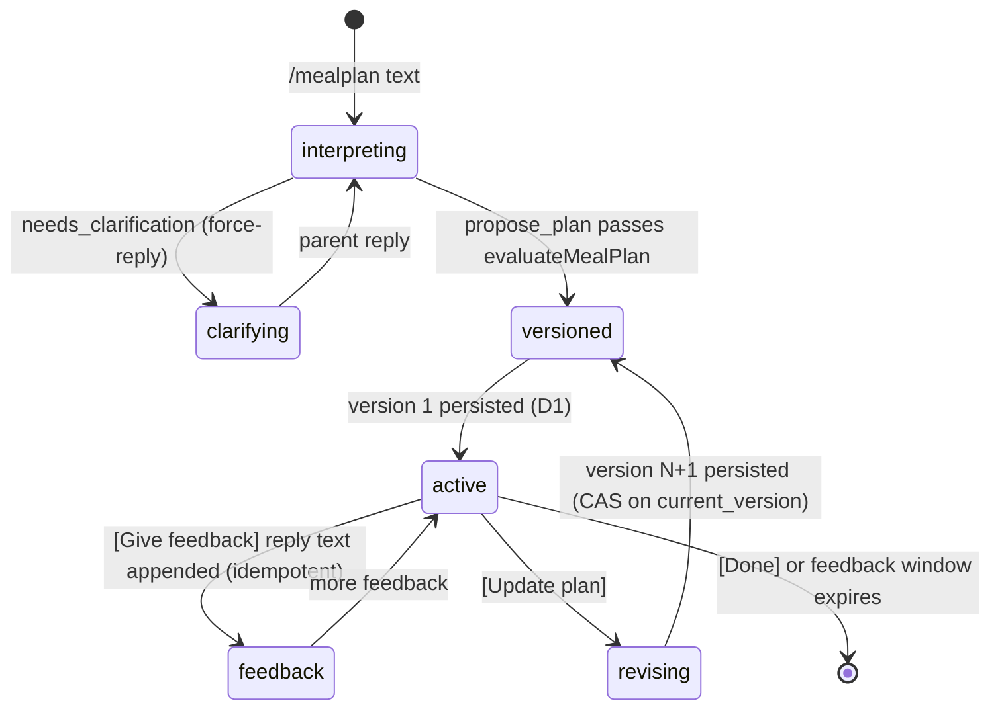

# School-Day Meal Planning — Iteration 1: Telegram-first Workflow

> **Status:** Plan for GitHub issue #65 (parent: #59; prerequisite: #64 corpus/evaluator, merged)
> **Document role:** Design of the first deliverable slice of the School-Day Meal
> Planning workflow: durable D1 contracts, the bounded planning-agent loop wired
> to the deterministic `evaluateMealPlan` evaluator, a Telegram-first
> conversation surface, versioned plan persistence with stale-revision
> rejection, and the #64 corpus as the documented quality gate.

## 1. Goal

Deliver a usable Telegram-first school-week meal-planning workflow. A parent
can start a planning conversation in Telegram text, receive a Monday–Saturday
plan rendered as Telegram text, reply with targeted meal feedback, and receive
a new persisted active-plan version. The active plan and its revision history
survive process restarts as versioned canonical records in Cloudflare D1.

This iteration reuses the already-merged deterministic evaluator and corpus
(#64). It introduces no separate review agent, no Mini App, no voice
transcription, and no multi-bot support — all recorded as out of scope in the
issue.

## 2. Scope and boundary

### In scope

- D1 database binding, migration schema, and a thin typed store for: household
  profile, plan, immutable plan version, feedback batch, agent job, and audit
  records.
- One bounded planning-agent loop with the deterministic `evaluate_meal_plan`
  tool and the agent-owned free-form policy self-validation loop (`satisfied` /
  `trade-off` / `needs-clarification` outcomes). No reviewer agent.
- Telegram-first surface: `/mealplan` to start or continue planning,
  `/plan` to retrieve the active plan during the week, targeted clarification
  via force-reply, and plan review with inline actions (Give feedback /
  Update plan / Done).
- Plan versioning: active plan is versioned; feedback binds to an exact base
  version; stale revisions are rejected; retried submissions are idempotent.
- Deterministic plan rendering as Telegram text (fridge-board equivalent).
- Recipe-video discovery as **optional, non-blocking enrichment** for school
  lunch and home lunch cells; a missing video never removes or blocks a plan.
- The #64 corpus as a documented quality gate, including new agent-level tests
  that drive the loop from corpus scenarios.

### Out of scope (recorded, not built)

- Telegram Mini App review, visual weekly grid, local feedback drafts.
- Multi-bot support (#63), voice-note transcription (#61).
- A separate reviewer agent (explicitly excluded by the planning-decisions
  document).
- Persistent-profile editing UX (an open product decision in the spec); the
  initial household profile is seeded, not editable in this iteration.
- Grocery ordering, inventory tracking, shopping support.
- D1 backup/export automation, dashboards, or usage metrics beyond
  `logRuntime` + the `agent_job` table.

## 3. Architecture

Mirror the proven Calendar shape (bounded agent session, deterministic
evaluator, durable workflow, interaction router). D1 is the long-term store;
the Workflow coordinates one planning conversation and revision turns.

```text
triggers/telegram-webhook.ts
  ├─ /mealplan <text> ──▶ MealPlanningWorkflow.create({ chatId, requestKind:"initial_plan", requestText })
  ├─ /plan            ──▶ read active plan from D1, render, send (no agent)
  └─ routed interactions (kind meal-*) ──▶ MealPlanningWorkflow instance events

meal-planning/workflow.ts            WorkflowEntrypoint → agent-workflow runner
meal-planning/agent-workflow.ts      bounded turn loop: session, clarifications,
                                     persistence, plan send, feedback window, revision
agent/meal-planning-session.ts       bounded tool session (mirrors calendar-session)
agent/meal-planning.ts               static zod tool definitions:
                                       evaluate_meal_plan, propose_plan, needs_clarification
meal-planning/evaluation.ts          evaluateMealPlan(candidate, context)  [exists, reused]
meal-planning/types.ts               MealPlanContext, MealPlanCandidate, ...  [exists]
meal-planning/coverage.ts            coverage set  [exists]
meal-planning/store.ts               D1 client: profile, plan, plan_version,
                                     feedback_batch, agent_job, meal_audit (+ seed profile)
meal-planning/messages.ts            MEAL_HELP, renderPlanMessage, fixed notices
meal-planning/video.ts               optional YouTube enrichment, never blocking
core/interaction-router.ts           per-chat opaque routing [exists, extended: chat-scoped generation]
```

Dependency direction matches `docs/architecture/modules.md`: triggers → workflow
→ agent → (meal-planning domain, providers, runtime, integrations, router, D1
store). The store is the only module that touches the D1 binding.

### State lifecycle



The planning conversation lives inside one workflow instance for a bounded
feedback window (default 48 h, configurable). After the window expires the
instance ends; the active plan and history remain readable from D1 via `/plan`.

## 4. Durable contracts (D1)

One database `MEAL_PLANNING_DB` (`d1_databases` binding), migration
`migrations/0001_init.sql`. All JSON columns hold normalized structured data
per `src/meal-planning/types.ts`; no transcripts or raw provider text are
stored (privacy rule inherited from Calendar).

```sql
-- Household profile (single-bot: one row per Telegram chat)
CREATE TABLE meal_profile (
  chat_id TEXT PRIMARY KEY,
  profile_json TEXT NOT NULL,            -- MealProfile
  custom_policies_json TEXT NOT NULL,    -- CustomPolicy[]
  schedule_json TEXT NOT NULL,           -- MealSchedule
  location_json TEXT,                    -- { country, city } | NULL
  interaction_generation INTEGER NOT NULL DEFAULT 0, -- chat-scoped plan-message generation (§6)
  version INTEGER NOT NULL DEFAULT 1,
  created_at TEXT NOT NULL, updated_at TEXT NOT NULL
);

-- Plan header: one active plan per chat (previous active → 'replaced')
CREATE TABLE meal_plan (
  plan_id TEXT PRIMARY KEY,
  chat_id TEXT NOT NULL,
  week_start TEXT NOT NULL, week_end TEXT NOT NULL, timezone TEXT NOT NULL,
  status TEXT NOT NULL DEFAULT 'active',            -- active | replaced
  current_version INTEGER NOT NULL DEFAULT 0,
  weekly_inventory_json TEXT NOT NULL DEFAULT '{}', -- week-scoped state
  weekly_exceptions_json TEXT NOT NULL DEFAULT '{}',
  created_at TEXT NOT NULL, updated_at TEXT NOT NULL
);
CREATE INDEX idx_meal_plan_chat ON meal_plan(chat_id, status);

-- Exactly one active plan per chat, enforced by the database. A concurrent
-- second active INSERT fails atomically (whole batch rolls back).
CREATE UNIQUE INDEX idx_meal_plan_one_active ON meal_plan(chat_id) WHERE status = 'active';

-- Immutable plan versions. No UPDATE statements ever target this table.
CREATE TABLE meal_plan_version (
  plan_id TEXT NOT NULL, version INTEGER NOT NULL,
  candidate_json TEXT NOT NULL,          -- grid + easyBuys + policyOutcomes
  evaluation_json TEXT NOT NULL,         -- failures + measurements
  request_kind TEXT NOT NULL,            -- initial_plan | revision
  base_version INTEGER,                  -- NULL for initial
  feedback_batch_id TEXT,
  video_json TEXT NOT NULL DEFAULT '{}', -- per-cell video results (lunch slots)
  created_at TEXT NOT NULL,
  PRIMARY KEY (plan_id, version)
);

-- Feedback: one open batch per plan version, created empty and atomically with
-- the version row it tracks (no Telegram update id exists at creation — the
-- row is opened when the plan is persisted, not when a reply arrives). Items
-- are appended from force-reply text; idempotency is per item via
-- FeedbackItem.updateId (see store invariants), not at the batch level.
CREATE TABLE feedback_batch (
  batch_id TEXT PRIMARY KEY,             -- plan_id || ':v' || base_version
  chat_id TEXT NOT NULL, plan_id TEXT NOT NULL,
  base_version INTEGER NOT NULL,         -- plan version this feedback targets
  items_json TEXT NOT NULL DEFAULT '[]', -- FeedbackItem[] (stable ids; each carries updateId?)
  status TEXT NOT NULL DEFAULT 'open',   -- open | applied | rejected
  applied_to_version INTEGER,
  created_at TEXT NOT NULL, applied_at TEXT
);
-- One open batch per plan version (defense in depth: creation is serialized by
-- the persistence batch, which is the only writer).
CREATE UNIQUE INDEX idx_feedback_open_batch ON feedback_batch(plan_id, base_version) WHERE status = 'open';

-- Agent job: one row per workflow run (outcome + metadata, no transcripts)
CREATE TABLE agent_job (
  job_id TEXT PRIMARY KEY,
  chat_id TEXT NOT NULL, plan_id TEXT,
  request_kind TEXT NOT NULL,
  outcome TEXT NOT NULL,                 -- succeeded | failed | clarification_needed
  failure_reason TEXT, metrics_json TEXT,-- turns, tool calls, tool names, summaries
  workflow_instance TEXT,
  created_at TEXT NOT NULL, completed_at TEXT
);
CREATE INDEX idx_agent_job_chat ON agent_job(chat_id, created_at);

-- Append-only audit
CREATE TABLE meal_audit (
  audit_id INTEGER PRIMARY KEY AUTOINCREMENT,
  chat_id TEXT NOT NULL,
  entity_type TEXT NOT NULL,             -- plan_version | feedback_batch | plan
  entity_id TEXT NOT NULL,
  action TEXT NOT NULL,                  -- created | applied | rejected
  detail_json TEXT, workflow_instance TEXT,
  created_at TEXT NOT NULL
);
CREATE INDEX idx_meal_audit_chat ON meal_audit(chat_id, created_at);

-- Optional video enrichment cache (per #60 spike): 24 h TTL, expired rows deleted on use
CREATE TABLE recipe_video_cache (
  cell_key TEXT PRIMARY KEY,             -- dish:slotId
  status TEXT NOT NULL,                  -- found | no_suitable_video
  url TEXT, title TEXT, channel TEXT,
  fetched_at TEXT NOT NULL, expires_at TEXT NOT NULL
);
```

### Store module (`meal-planning/store.ts`)

`MealPlanningStore` interface with two implementations:

- `createMealPlanningStore(db: D1Database)` — production binding, SQL via
  `prepare/bind/run/first/all`.
- `createInMemoryMealPlanningStore()` — Map-backed fake for unit/integration
  tests (same invariant logic, no SQL).

Invariants enforced at the store layer (deterministic, unit-tested):

- **One active plan per chat, by construction:** the partial unique index
  `idx_meal_plan_one_active` rejects any insert of a second active row that did
  not first supersede its predecessor (it is the database-level invariant; the
  in-memory fake enforces the same rule). Week semantics: an explicit
  `/mealplan` always creates a new active plan and atomically supersedes the
  previous active row in the same batch (spec §2: "the latest plan is the
  active plan for that week"). The superseded plan stays readable in
  `meal_plan_version` history; the parent is told the previous plan was
  replaced.
- **Immutable versions:** insert-only `meal_plan_version`; a version row is
  never updated or deleted.
- **Atomic create-active-plan (initial):** one `db.batch` of
  1. `UPDATE meal_plan SET status = 'replaced', updated_at = ? WHERE chat_id = ? AND status = 'active'`
  2. `INSERT INTO meal_plan (plan_id, chat_id, week_start, week_end, timezone, status, current_version, ...) VALUES (?, ?, ..., 'active', 1, ...)`
  3. `INSERT INTO meal_plan_version (plan_id, version, ...) VALUES (?, 1, ...)`
  4. `INSERT INTO feedback_batch (batch_id, chat_id, plan_id, base_version, items_json, status, created_at) VALUES (?, ?, ?, 1, '[]', 'open', ?)` (batch_id = `plan_id || ':v1'`)
  5. `UPDATE meal_profile SET interaction_generation = interaction_generation + 1 WHERE chat_id = ?`
  6. `SELECT interaction_generation FROM meal_profile WHERE chat_id = ?` — returns this plan message's generation (used for the action registrations in step 5 of §6)
  D1 batch is a single transaction: **either the whole new plan exists (active
  row + version 1 + its empty open feedback batch + the bumped generation) and
  any previous active row is atomically replaced, or nothing changes** — any
  statement failure rolls back the entire batch (no orphan version row, no
  half-replaced state, no orphan generation bump).
  **Concurrency semantic is deliberately serialize-and-supersede**, matching
  spec §2: a second `/mealplan` batch that commits after the first likewise
  replaces the first batch's fresh active row (its supersede-UPDATE matches it
  because it is still `active`), so its INSERT never violates the partial
  index. The `plan-already-active` rejection cannot arise from this SQL and is
  not part of the design; there is no atomic compare/insert guard. The caller
  reads statement 1's `meta.changes` — `0` → first plan for the chat (no
  notice); `>= 1` → a previous active plan was replaced and the parent gets a
  "previous plan replaced" notice. Two concurrent starts simply resolve
  last-commit-wins; the superseded plan stays readable in version history and
  any button on its stale message routes to a replaced plan (revision returns
  `stale`, §6).
- **Atomic revision promotion (`plan_id`-scoped):** one `db.batch` of, in
  order (`oldVersion` = the CAS base the caller believes is current,
  `newVersion` = `oldVersion + 1`):
  1. `INSERT INTO meal_plan_version (plan_id, version, candidate_json, evaluation_json, request_kind, base_version, feedback_batch_id, video_json, created_at) SELECT ?, ?, ?, ?, 'revision', ?, ?, ?, ? FROM meal_plan WHERE plan_id = ? AND current_version = oldVersion AND status = 'active'`
  2. `UPDATE meal_profile SET interaction_generation = interaction_generation + 1 WHERE chat_id = ? AND EXISTS (SELECT 1 FROM meal_plan WHERE plan_id = ? AND current_version = oldVersion AND status = 'active')` — the generation bump, guarded on the CAS base like everything else
  3. `SELECT interaction_generation FROM meal_profile WHERE chat_id = ?` — returns this plan message's generation (used only when the caller sees success)
  4. `UPDATE meal_plan SET current_version = newVersion, updated_at = ? WHERE plan_id = ? AND current_version = oldVersion AND status = 'active'`
  5. `UPDATE feedback_batch SET status = 'applied', applied_to_version = newVersion, applied_at = ? WHERE plan_id = ? AND base_version = oldVersion AND status = 'open' AND EXISTS (SELECT 1 FROM meal_plan WHERE plan_id = feedback_batch.plan_id AND current_version = newVersion AND status = 'active')`
  6. `INSERT OR IGNORE INTO feedback_batch (batch_id, chat_id, plan_id, base_version, items_json, status, created_at) SELECT ?, chat_id, plan_id, newVersion, '[]', 'open', ? FROM meal_plan WHERE plan_id = ? AND current_version = newVersion AND status = 'active'` (batch_id = `plan_id || ':v' || newVersion`)
  **Every statement is conditional on a successful promotion.** Statements 1–2
  and 4 no-op via the CAS base guard (`current_version = oldVersion` — the
  bump's `EXISTS` reads the plan row before statement 4 advances it, so a
  stale call never bumps the generation), and the `current_version =
  newVersion` guards on 5–6 can only match *after* statement 4 has advanced
  the row. Order therefore matters, and a stale call changes nothing:
  1–2 no-op on the CAS base; 4 no-ops on the CAS base; 5 no-ops because the
  batch is either already applied or `current_version ≠ newVersion` / the plan
  is no longer `active`; 6 inserts nothing because its SELECT matches 0 rows.
  Statement 3 is a read the caller ignores on stale. The one deliberate
  exception is the same-target race: two concurrent revisions from the same
  base both compute the same `newVersion`; when the loser runs after the
  winner, statements 1–2 and 4 match 0 rows (the winner already advanced past
  `oldVersion`), 5's guard passes but the batch is already `applied` (0 rows),
  and 6's SELECT matches the winner's advanced row — `INSERT OR IGNORE` then
  absorbs the already-existing open batch for that version (unique
  `idx_feedback_open_batch`) as a clean no-op instead of a constraint error.
  `meal-planning-store.test.ts` asserts **all five writes are unchanged on a
  stale call** (no version row, generation unmoved, `current_version` unmoved,
  source batch still `open`, no new batch row).
  **One defined atomic outcome:** the new version row, the `current_version`
  advance, the source feedback-batch transition to `applied`, the fresh
  empty open batch for the new version, and the generation bump all commit or
  all roll back together. `plan_id` is the PK and `status = 'active'` is
  guarded, so the batch can never promote more than one row or a replaced
  plan. Concurrent same-base revisions serialize on the transaction; the
  loser's SELECT matches 0 rows.
  **Post-batch diagnostics (recovery defined):** the caller gates on statement
  1's `meta.changes` — `1` → success; `0` → `{ ok: false, reason: "stale" }`.
  On stale, no compensation is needed (nothing changed) and the caller writes
  the `rejected/stale` audit + agent-job rows and sends `meal-stale-plan`.
  Audit and job rows are written *after* the batch commits, best-effort: a
  failure there loses diagnostics only, never state. They are idempotent —
  `agent_job.job_id` = workflow instance id with `INSERT OR IGNORE` (a retry
  after crash writes at most one job row), and `meal_audit` is append-only so
  a duplicated row is harmless.
- **One open feedback batch per plan version:** every persisted version has
  exactly one empty `open` batch row, created atomically with the version
  (createActivePlan statement 4 / promotePlanVersion statement 6 above). `appendFeedback(planId,
  baseVersion, item)` finds the open batch for `(plan_id, base_version)` and
  appends; if no `open` batch exists for that base version (it was already
  applied or the version was superseded) the append is a defined no-op —
  `{ ok: false, reason: "no_open_batch" }` — and the branch drops the reply.
  The router's generation-scoped cleanup (§6) makes this unreachable in normal
  flow; the store contract is still total.
- **Feedback idempotency (per item):** each reply-derived `FeedbackItem`
  carries `updateId` = the Telegram update id of the force-reply. The router's
  durable single-claim on `consumed_update_id` is the primary dedupe — a
  retried delivery of the same update id resolves to `{ interaction: null }`
  and never reaches the store. `appendFeedback` adds a store-level guard: if
  an item with the same `updateId` is already in `items_json`, it no-ops
  (`{ ok: true, duplicate: true }`). The batch row itself carries no Telegram
  update id — it exists from plan-send time, when no update exists.
- **Seed profile:** `loadOrCreateProfile(chatId)` inserts the initial household
  configuration (spec §5.11 initial set: Snack policy, Equipment gap, Packing
  capacity, two Nutrition targets) on first use, stored as generic properties +
  custom policies + the five-slot Mon–Sat schedule.

The in-memory fake mirrors the same operations and result semantics
(`ok`/`reason: "stale"`, one-active constraint, insert-only versions, one
open batch per plan version, per-item append idempotency) so the unit and
integration suites exercise identical invariants without SQL.

## 5. Planning-agent loop and tools

`agent/meal-planning-session.ts` runs `runTools` (bounded: 3 provider turns /
4 tool calls, `requireHandoff: true`) with a static registry
(`agent/meal-planning.ts`), mirroring the Calendar session. Tools:

| Tool | Input (zod, strict) | Output | Behavior |
| --- | --- | --- | --- |
| `evaluate_meal_plan` | `MealPlanCandidate` (grid, easyBuys, policyOutcomes) | `MealPlanEvaluation` (pass, failures, measurements) | Pure wrapper over `evaluateMealPlan`; tracked as `latestEvaluation` in the session closure |
| `propose_plan` (terminal) | `{ candidate, weeklyInventory, weeklyExceptions, feedbackItems? }` | `{ accepted: true }` | Handler re-runs `evaluateMealPlan` on the submitted candidate with the session context; requires `pass`, else `ToolHandlerError("proposed plan did not pass evaluation")`. For revisions, validates every provided raw feedback text is represented by a scoped `feedbackItems` entry or an outcome rationale (matches `unaddressed_feedback`) |
| `needs_clarification` (terminal) | `{ message, reasonCodes: FailureCode[], interaction: { kind: "reply" } }` | `{ accepted: true }` | Enforces every failure from `latestEvaluation` is included; message cannot expose opaque ids |

Agent self-validation loop (spec §7 / planning-decisions): the agent proposes a
candidate, calls `evaluate_meal_plan`, revises objective failures, self-checks
free-form policy (recording `satisfied` / `trade-off` / `needs-clarification`
with concise rationale — completeness enforced by the evaluator's
`missing_policy_outcome`), then either calls `propose_plan` or asks one
targeted clarification. The system prompt states the rules and the boundary:
the agent owns free-text interpretation and normalization into the canonical
tokens the evaluator checks (exact string membership only); it must clarify
ambiguous exclusions before they become hard constraints.

Unlike Calendar, no opaque plan ledger is needed: the write target is our own
D1 store and the evaluator is pure/replayable, so `propose_plan` carries the
candidate and the handler re-verifies it deterministically.

## 6. Workflow sequence (`meal-planning/workflow.ts` + `agent-workflow.ts`)

`MealPlanningWorkflowParams`:
`{ chatId, telegramMessageId, requestKind: "initial_plan" | "revision", requestText }`.

`runAgentCenteredMealPlanningWorkflow(env, event, step)`:

1. **Load state:** `loadOrCreateProfile(chatId)`; active plan for chat
   (becomes `recentPlan` for variety); the open feedback batch for the active
   plan's current version (its items feed the revision context).
2. **Session turn loop** (bounded by `MEAL_PLANNING_TTL_MS`, default 30 min per
   interaction):
   - Build `MealPlanContext` (profile, custom policies, weekly inventory/
     exceptions from plan row or conversation, recent plan, request kind,
     feedback items).
   - Run `runMealPlanningAgentSession` in a `step.do`.
   - `needs_clarification` → `promptForReply` (force-reply, kind
     `meal-clarification`, registered **without** a generation — it precedes
     any plan message, so no plan-message generation exists to attach; its
     invalidation is the normal single-claim + expiry, and the session cannot
     persist while a clarification is pending) → append reply → next turn.
   - `propose_plan` → persist (below) → break.
   - Agent failure/timeout → `meal-agent-unavailable` notice; record job.
3. **Persist:** initial → `createActivePlan` (atomic batch, §4); revision →
   `promotePlanVersion` (`plan_id`-scoped atomic batch, §4). Each batch makes
   the plan/version/feedback-batch state changes one atomic outcome, opens
   the next version's empty feedback batch, and bumps the chat-scoped plan
   message generation (returned to the caller for step 5); audit + agent-job
   rows are written after commit as idempotent, best-effort diagnostics (§4
   recovery). Promotion failure (stale) → `meal-stale-plan` notice, no version
   written, `rejected/stale` audit + job rows.
4. **Optional enrichment:** fill `recipeVideo` for school-lunch and home-lunch
   cells via `video.ts` **before** persisting the version (deterministic gate,
   never blocking; see §8).
5. **Send plan message** (`renderPlanMessage`, Markdown) with inline buttons
   `[Give feedback] [Update plan] [Done]`; in one durable `step.do` register
   three callback interactions (group `"meal-planning"`, `expiresAt =
   feedbackDeadline`, `generation: <planGeneration>`):
   - `{ interactionId, version: <planVersion>, workflowId: instanceId, kind:
     meal-feedback, callbackToken, botMessageId: planMessageId }`
   - same for `meal-update` and `meal-done` (distinct tokens).
   `version` binds the buttons to the plan version the parent is looking at and
   is the base version used by the revision branch. `planGeneration` is the
   value returned by the persistence batch (§4 — createActivePlan statements
   5–6, promotePlanVersion statements 2–3): a chat-scoped monotonic counter
   that every persisted plan message (initial or revision) increments exactly
   once, atomically with its own version rows.
   **Chat-scoped generation invalidation:** every post-persist meal-planning
   registration (action sets here, the `meal-feedback-reply` force-reply
   prompt in step 6) carries the generation of the plan message it belongs
   to. The router tags each row with it, deletes every unconsumed row in the
   group with a *lower* generation at registration time, and on resolve
   returns `{ interaction: null }` for any row below the group's highest
   present generation. Because the counter is per chat and increments per
   plan message (not per plan or version), a fresh `/mealplan` that replaces
   a distinct plan bumps past the old plan's registrations even when both
   plans are at version 1 — the old plan's action buttons and any pending
   `meal-feedback-reply` prompt resolve nothing after the successor
   registers, for revisions and for a newer `/mealplan` alike. A superseded
   instance's registration that lands late still carries its own (lower)
   plan message generation, so it can never invalidate the successor's
   buttons and its own rows resolve null. Pre-persist clarification prompts
   carry no generation (they precede any plan message) and are invalidated
   by single-claim + expiry alone. Calendar registrations carry no generation
   and keep the existing version-based cleanup.
6. **Feedback window loop** until absolute deadline (`MEAL_FEEDBACK_WINDOW_MS`,
   default 48 h, env-overridable). `step.waitForEvent("telegram-reply",
   timeout = remaining)`, then dispatch on `interactionKind`:

   | Event kind | Source | Branch (all sends/registers inside `step.do`) |
   | --- | --- | --- |
   | `meal-feedback` | inline-button callback, one-time | `promptForFeedbackReply`: send force-reply prompt `"Reply with your feedback for this plan (e.g. 'Wed lunch: too oily')."` via `step.do`; register one reply interaction `{ interactionId, version: <planVersion>, workflowId: instanceId, kind: "meal-feedback-reply", botMessageId: promptMessageId, expiresAt: feedbackDeadline, interactionGroup: "meal-planning", generation: <planGeneration> }`. Continue waiting. |
   | `meal-feedback-reply` | force-reply text (replyTo the prompt) | Append `FeedbackItem { id, text, updateId: <reply update id> }` to the open batch for `(plan_id, interaction.version)` via `appendFeedback` — idempotent per item (router single-claim + store guard on `updateId`, §4); send `meal-feedback-noted` notice. Continue waiting. |
   | `meal-update` | inline-button callback, one-time | Run the revision session (step 2) with `basePlanVersion = interaction.version`. Success → send the new plan message with fresh buttons + register a new action set (step 5); the promotion batch (§4) applied the source batch and opened the new version's empty batch. Stale (`promotePlanVersion` returns `stale`) → `meal-stale-plan` notice. Continue waiting. |
   | `meal-done` | inline-button callback, one-time | Send `meal-finalized` notice; end. The active plan stays in D1. |
   | timeout | `waitForEvent` deadline | End. The active plan stays in D1. |

   **Duplicate and stale handling** (deterministic, no LLM):
   - The router claims each interaction once by `consumed_update_id` /
     `callbackToken`; a Telegram retry of the same update id resolves to
     `{ interaction: null }` and is logged `ignored` at the webhook — a
     duplicate button tap or duplicate reply can never re-enter the loop.
   - A second, different reply to the same force-reply prompt resolves nothing
     (the only interaction bound to that `botMessageId` is already consumed),
     so a stray second reply is ignored.
   - The `meal-feedback` button branch is one-shot by construction: the tap
     consumed its callback interaction, and the follow-up text arrives on the
     new `meal-feedback-reply` interaction.
   - Every action interaction expires at `feedbackDeadline`; the router drops
     expired rows and `waitForEvent` times out at the same deadline, so the
     instance ends cleanly and no interaction survives the window.
7. **Retrieval during the week:** `/plan` reads the active plan directly from
   D1 and renders it — no agent, no workflow instance.

Routing (`telegram-webhook.ts`): kinds `meal-*` dispatch to
`MEAL_PLANNING_WORKFLOW`; planning-conversation interactions carry the live
instance id (sendEvent, like Calendar). `/mealplan` with no argument shows
help; `/plan` shows the active plan (or help).

## 7. Telegram surface and rendering

- `/mealplan <context>` — start planning; the agent asks only for
  week-relevant facts (inventory/exceptions) and confirms them in plain
  language before proposing (spec §5.11).
- `/plan` — render the active plan.
- Plan message: compact fridge-board-equivalent, phone-friendly, deterministic
  (`messages.ts`, pure function, snapshot-tested). Per day, five slot lines;
  dish + optional prep label + easy-buy marker; a short pending-feedback
  indicator when the version's open batch has items (spec §5.11: pending
  changes exist only while feedback exists); material trade-offs summarized from
  `policyOutcomes` (labels only, no essay). Video links shown only when a
  `found` result exists.
- Interaction kinds added to `INTERACTION_KIND`: `meal-clarification`,
  `meal-feedback`, `meal-feedback-reply`, `meal-update`, `meal-done` (all
  `meal-*` prefixed for routing). No new plain-text routing kinds: feedback
  and clarifications arrive as force-reply replies (replyTo resolution),
  matching the Calendar pattern.

## 8. Optional recipe-video enrichment (`meal-planning/video.ts`)

- Schema: `MealCell.recipeVideo?: { status: "found" | "no_suitable_video" |
  "not_attempted"; url?; title?; channel? }` (types.ts addition).
- Behavior: for school-lunch and home-lunch cells only. When
  `YOUTUBE_API_KEY` is configured, query the YouTube Data API per the #60
  spike design (search.list + videos.list, trusted-channel preference,
  `no_suitable_video` on miss), cache 24 h in `recipe_video_cache`. When the
  key is absent or any step fails, the cell records `no_suitable_video` (or
  `not_attempted`) and the plan proceeds unchanged. Hard ceiling on calls per
  plan; results never gate or alter the plan.
- Iteration 1 keeps the adapter thin and flag-gated; the full #60 remaining
  work (server-side secret binding, rate limiting, cache cleanup) is a
  follow-up.

## 9. Quality gate (#64 corpus)

- Existing suites stay: `meal-planning-corpus.test.ts` (corpus health),
  `meal-planning-evaluation.test.ts` (candidate runner) — `pnpm test`.
- New `meal-planning-agent.test.ts`: drives `runMealPlanningAgentSession` with
  a mocked provider over each corpus scenario's `pass: true` candidates →
  asserts `propose_plan` is accepted and the evaluation passes; for
  `behavior.expectsClarification` scenarios → asserts `needs_clarification`
  with the expected policy outcomes. This makes the corpus the documented gate
  for the planning loop (issue acceptance criterion 5).
- New `meal-planning-store.test.ts`: one-active-per-chat constraint,
  `createActivePlan` atomicity — a second create supersedes the first
  (serialize-and-supersede), any statement failure rolls back the whole
  batch (no orphan version row, previous active stays), and the generation is
  bumped exactly once per created plan message, `promotePlanVersion`
  stale rejection asserting **all five batch writes are unchanged** (no
  version row, generation unmoved, `current_version` unmoved, source feedback
  batch still `open`, no new batch row) — including the same-target race where
  a concurrent revision already committed the same `newVersion` (plus: success
  applies the open source batch, opens the next version's batch, and bumps the
  generation in the same transaction), insert-only versions, one open batch
  per plan version, `appendFeedback` idempotency by item `updateId`, restart
  survival (fresh store instance reads the active plan).
- Extended `interaction-router.test.ts` (existing): a registration carrying a
  `generation` removes the group's lower-generation unconsumed rows and is
  tagged with it; a row below the group's highest present generation resolves
  to `{ interaction: null }` (including rows that registered after the
  successor's cleanup ran — the late-registration case); registrations without
  a generation keep the legacy version-based cleanup and never resolve null on
  generation grounds.
- New Telegram e2e (`meal-planning-telegram-workflow.integration.test.ts`):
  webhook → workflow → in-memory store → fake Telegram, covering: full happy
  path (context → plan v1 → [Give feedback] button → force-reply prompt →
  feedback text → [Update plan] → plan v2), stale revision rejection (base
  version < current), retried callback and retried feedback delivery (router
  single-claim + per-item `updateId` guard), **mid-window replacement: a
  fresh `/mealplan` supersedes plan v1 while its feedback window is alive —
  the old plan's action buttons and its pending force-reply prompt resolve
  nothing (generation invalidation) while the new plan's buttons work**, and
  restart survival.

## 10. File changes

New:

- `migrations/0001_init.sql` — D1 schema above, including the partial unique
  index `idx_meal_plan_one_active` and `idx_feedback_open_batch`. During
  `wrangler d1 migrations apply`, confirm the partial indexes are accepted;
  fallback if rejected: single active row per chat enforced by making
  `chat_id` the `meal_plan` PK and moving superseded plans to a
  `meal_plan_record` history table (same store interface, same invariants).
- `src/meal-planning/store.ts` — store interface + D1 impl + in-memory fake +
  seed profile; operations `loadOrCreateProfile`, `createActivePlan`,
  `promotePlanVersion` (both persistence batches also open the next version's
  empty feedback batch and apply the source batch on promotion),
  `activePlan`, `appendFeedback` (per-item `updateId` dedupe),
  `markFeedbackBatchApplied`, `recordJob`, `recordAudit`.
- `src/meal-planning/workflow.ts` — `MealPlanningWorkflow` entrypoint.
- `src/meal-planning/agent-workflow.ts` — runner (session loop, persistence, feedback window, revision).
- `src/meal-planning/messages.ts` — help, `renderPlanMessage`, fixed notices.
- `src/meal-planning/video.ts` — optional enrichment.
- `src/agent/meal-planning.ts` — tool definitions + zod schemas.
- `src/agent/meal-planning-session.ts` — bounded session.
- `src/__tests__/meal-planning-store.test.ts`, `meal-planning-messages.test.ts`,
  `meal-planning-agent.test.ts`.
- `src/__integration__/meal-planning-telegram-workflow.integration.test.ts`.

Modified:

- `wrangler.toml` — `[[d1_databases]]` binding `MEAL_PLANNING_DB`,
  `[[workflows]]` binding `MEAL_PLANNING_WORKFLOW`, optional `YOUTUBE_API_KEY` var.
- `src/core/types.ts` — `Env` additions (`MEAL_PLANNING_DB: D1Database`,
  `MEAL_PLANNING_WORKFLOW: Workflow`, `YOUTUBE_API_KEY?`), `INTERACTION_KIND` meal kinds.
- `src/triggers/telegram-webhook.ts` — `/mealplan`, `/plan` commands; `meal-*` dispatch.
- `src/index.ts` — export `MealPlanningWorkflow`.
- `src/core/interaction-router.ts` — optional chat-scoped generation on group
  registrations: new nullable `generation` column (same ALTER pattern as
  `interaction_group`). A registration that carries `generation` (a number)
  tags its row with it and deletes the group's lower-generation unconsumed
  rows (replacing the version-based cleanup for that registration); `resolve`
  returns `{ interaction: null }` for a row whose generation is below the
  group's highest present generation (a `SELECT MAX(generation)` over the
  group's rows — no separate counter storage). Registrations without a
  generation are unchanged (Calendar keeps the version-based cleanup). The
  value itself is assigned by the meal-planning persistence batches in D1
  (§4), not by the router.
- `src/core/interaction-router-client.ts` — `InteractionRegistration.generation?:
  number` (explicit plan-message generation; absent for Calendar).
- `src/__integration__/setup.ts` — fake router mirrors the generation tagging,
  the lower-generation cleanup, and the resolve-null check.
- `src/__tests__/interaction-router.test.ts` — generation behavior (see §9).
- `src/meal-planning/types.ts` — `MealCell.recipeVideo` (optional),
  `FeedbackItem.updateId` (optional; reply-derived items only).
- `src/meal-planning/corpus/schema.ts` — `feedbackItemSchema` accepts the
  optional `updateId` field (strict schema, so the type change must be
  mirrored here; corpus items omit it).
- `docs/architecture/architecture.yaml`, `data-and-state.md`, `modules.md`,
  `request-flows.md` — per ADR-001 (D1 store, meal-planning workflow module,
  Telegram commands).

## 11. Validation

```bash
pnpm typecheck
pnpm lint            # biome check src/
pnpm run docs        # tools/require-jsdoc.mjs (JSDoc on all new exported functions)
pnpm test            # unit: store, messages, agent, evaluator + corpus suites
pnpm test:integration
```

`lefthook` pre-commit runs typecheck, lint, and both test suites. The plan
commit itself is documentation-only and does not touch `src/`.

## 12. Follow-ups (separate issues)

- Long-lived midweek feedback window after the conversation deadline (new
  instance per feedback event; the version's open batch is reused, so no
  create-batch step is needed).
- Profile-editing conversation (open product decision).
- #60 remaining production work: YouTube secret binding, rate limiting,
  cache cleanup, refresh policy.
- D1 backup/export automation and read/write metrics (feasibility guardrails).

## 13. Open questions

None blocking. Notes for review:

1. Feedback window default of 48 h (env-overridable) keeps one workflow
   instance alive per conversation; a longer window means a longer-lived
   instance, which is free on Cloudflare Workflows but extends interaction
   registrations.
2. Weekly inventory/exceptions live on the `meal_plan` row (week-scoped
   state, per spec §5.11); they expire when a new plan replaces the row.
